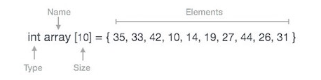
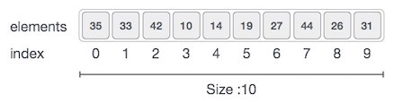
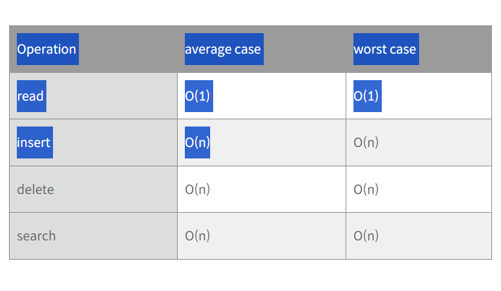

# array

### 배열이란?

배열은 연속된 메모리 공간에 순차적으로 저장된 데이터의 모음이다.

대부분에 프로그램 언어에서는 동일 타입의 데이터를 저장한다. 예를 들어 배열이 int 타입이면 정수 요소만 저장할 수 있다.

배열을 구성하는 각가의 값을 `요소(element)`라고 하며, 배열에서의 위치를 가리시는 숫자는 `인덱스(index)`라고 한다.

### 배열의 표현

c언어로 배열을 선언하면 아래와 같이 선언 할 수 있다.

위 배열을 그림으로 표현하면 아래와 같다.

- 연속된 메모리 공간에 데이터를 순착적으로 저장할 수 있다.
- C에서 인덱스는 0부터 시작한다.
- 배열 크기는 10이므로 10개의 요솔르 저장할 수 있다.
- 각 요소는 인덱스를 통해 액세스 할 수 있다.

### 배열의 시간 복잡도

### 배열의 특징

- 동일한 데이터 유형을 가진다.

  - 주로 동일한 데이터 유형을 가지지만 이질형 데이터도 지원하는 프로그래밍 언어도 있다.
  - 이질형 데이터들이 모인 집합체는 주로 레코드라고 한다.

- 배열의 각 요소에 접근하는 시간은 0(1)로 모두 동일하다.

  - 기본위치 + 오프셋(요소크기 \* 인덱스) 연산으로 모든 요소에 접급 가능

- 연속된 메모리에 단일 블록화하며 데이터를 저장합니다.

  - 낭비되는 공간이 거의 없음
  - 다만, 큰 배열일 경우, 필요 메모리 할당이 불가능 할 수도 있다.

- 실제 메모리 상에서 물리적으로 데이터가 순차적으로 저장되기 때문에 데이터에 순서가 있으며, index가 존재하여 indexing 및 slicing이 가능합니다.
  - indexing: index를 사용해 특정 요소를 리스트로 부터 읽어들이는 것
  - slicing: 요소에 특정 부분을 따로 분리해 조작하는 것

### 장점

- 인덱스를 이용한 접근이 가능하기 때문에 모든 요소에 빠르게 접근할 수 있다.
- 기록 밀도가 1이기 때문에 공간 낭비가 적다.
  - 리스트, 그래스 등은 데이터 외에 포인터 등 부가정보를 가지기 때문에 기록밀도가 1이 안되지만, 배열은 부가정보 없이 데이터만 저장하기 때문에 기록밀도가 1이다.
- 간단하고 사용하기 쉽다.

### 단점

- 배열을 선언 한 후에는 할당 된 정적 메모리 때문에 크기를 변경할 수 없다.
- 중간에 특정 요소를 삽입 및 삭제하는 경우 항상 메모리가 순차적으로 이어져 있어야 하기 떄문에 삽입 및 삭제 된 요소로부터 위에 있는 모든 요소들을 이동시켜주어야 한다. 그렇기에 비용이 많이 든다.
- 배열의 크기가 대부분 정적으로 결정되기 때문에 삽입과 삭제가 동적으로 발생하는 상황에서 적절한 배열의 크기를 미리 결정하는 것이 어렵고, 이로 인해 오버플로나 저장공간의 낭비를 초래할 수 있다.

### 배열을 사용하는 경부

- 순차적인 데이터를 저장하며 값보다는 순서가 중요할 때
- 다차원 데이터를 다룰때
- 어떤 특정 요소를 빠르게 읽어야 할 때
- 데이터 사이즈가 자주 바뀌지 않으며 요소가 자주 추가되거나 삭제되지 않을때
