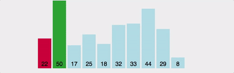
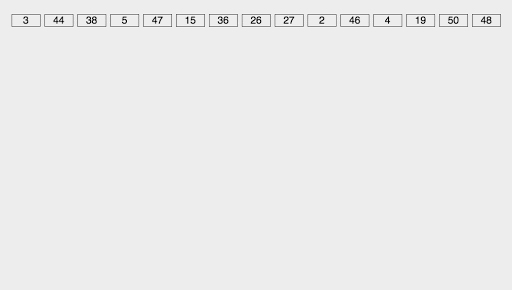

# 정렬

### 정렬 알고리즘이란?

목록 안에 저장된 요소들을 특정한 순서대로 재배치하는 알고리즘이다.

### 정렬을 사용하는 이유

- 좀 더 효율적인 알고리즘을 사용할 수 있다.
- 사람이 읽기 편하다

### 정렬시 고려할 사항

- 시간 복잡도
- 메모리 사용량
- 안전성: 데이터의 순서가 바뀌지 않느냐 여부 문제
- 직렬인지 병렬인지

모든경우에 대해 최선의 정답을 내는 알고리즘은 없다.
정렬 알고리즘을 선택할때 고려해야할점으론 아래와 같다.

> 1. 정렬할 데이터의 양
> 2. 데이터와 메모리
> 3. 이미 정렬된 정도
> 4. 필요한 추가 메모리의 양
> 5. 안정성

### 선택정렬



선택된 값과 나머지 데이터중에 비교하여 알맞은 자리를 찾는 알고리즘. 안정성은 보장되지 않는다.

#### 코드

```tsx
function selectionSort(arr) {
  // 배열의 길이만큼 반복
  for (let i = 0; i < arr.length; i++) {
    // 최소값의 인덱스를 i로 설정
    let minIndex = i;

    // 현재 i 이후의 요소들 중에서 최소값을 찾음
    for (let j = i + 1; j < arr.length; j++) {
      if (arr[j] < arr[minIndex]) {
        minIndex = j;
      }
    }

    // 최소값과 현재 i번째 요소를 교환
    [arr[i], arr[minIndex]] = [arr[minIndex], arr[i]];
  }

  return arr;
}

let arr = [64, 25, 12, 22, 11];
```

### 삽입정렬

데이터 집합을 순회하면서 정렬이 필요한 요소롤 뽑아내어 이를 다시 적당한곳으로 삽입하는 알고리즘.


#### 코드

```tsx
function insertionSort(arr) {
  // 배열의 두 번째 요소부터 시작해서 반복
  for (let i = 1; i < arr.length; i++) {
    let key = arr[i]; // 현재 삽입하려는 요소
    let j = i - 1;

    // 정렬된 부분에서 현재 요소보다 큰 요소를 찾음
    while (j >= 0 && arr[j] > key) {
      arr[j + 1] = arr[j]; // 요소를 오른쪽으로 이동
      j--;
    }

    // 현재 요소를 정확한 위치에 삽입
    arr[j + 1] = key;
  }

  return arr;
}

// 테스트 예제
let arr = [64, 25, 12, 22, 11];
```

### 버블정렬

거품이 수면으로 올라오는 듯 하여 붙여진 버블정렬. 인접한 두 수를 비교하여 오름차순or 내림차순. 안정성은 보장한다.


#### 코드

```tsx
function bubbleSort(arr) {
  let n = arr.length;

  // 배열 전체를 반복
  for (let i = 0; i < n - 1; i++) {
    // 마지막 i개의 요소는 이미 정렬되었으므로, 그 이전까지만 비교
    for (let j = 0; j < n - 1 - i; j++) {
      // 인접한 두 요소를 비교하여 잘못된 순서이면 교환
      if (arr[j] > arr[j + 1]) {
        // 요소 교환
        [arr[j], arr[j + 1]] = [arr[j + 1], arr[j]];
      }
    }
  }

  return arr;
}

// 테스트 예제
let arr = [64, 25, 12, 22, 11];
```

### 병합정렬

둘 이상의 부분집합으로 가르고, 각 부분집합을 정렬한 다음 부분집합들을 다시 정렬된 형태로 합치는 방식. 안정성은 보장한다.

- 분할: 해결하고자 하는 문제를 작은 크기의 동일한 문제들로 분활한다.
- 정복: 각각의 작은 문제를 순환적으로 해결한다.


#### 코드

```tsx
function mergeSort(arr) {
  // 배열의 길이가 1 이하이면 이미 정렬된 상태이므로 반환
  if (arr.length <= 1) {
    return arr;
  }

  // 배열을 중간 인덱스를 기준으로 두 부분으로 나누기
  const mid = Math.floor(arr.length / 2);
  const left = arr.slice(0, mid);
  const right = arr.slice(mid);

  // 재귀적으로 좌우 부분을 정렬한 후 병합
  return merge(mergeSort(left), mergeSort(right));
}

function merge(left, right) {
  let result = [];
  let leftIndex = 0;
  let rightIndex = 0;

  // 좌우 배열을 비교하여 작은 값을 결과 배열에 추가
  while (leftIndex < left.length && rightIndex < right.length) {
    if (left[leftIndex] < right[rightIndex]) {
      result.push(left[leftIndex]);
      leftIndex++;
    } else {
      result.push(right[rightIndex]);
      rightIndex++;
    }
  }

  // 남아있는 요소들을 결과 배열에 추가
  return result.concat(left.slice(leftIndex)).concat(right.slice(rightIndex));
}

// 테스트 예제
let arr = [64, 25, 12, 22, 11];
```

### 힙 정렬

트리 기반으로 최대 힙 트리or 최소 힙 트리를 구성해 정렬을 하는 방법. 안정성 보장 X 내림차순 정렬을 위해서는 최대 힙을 구성하고 오름차순 정렬을 위해서는 최소 힙을 구성하면 된다.


### 퀵 정렬

터 집합내에 임의의 기준(pivot)값을 정하고 해당 피벗으로 집합을 기준으로 두개의 부분 집합으로 나눈다. 한쪽 부분에는 피벗값보다 작은값들만, 다른 한쪽은 큰값들만 넣는다. 안정성 보장 X 더 이상 쪼갤 부분 집합이 없을 때까지 각각의 부분 집합에 대해 피벗/쪼개기 재귀적으로 적용.


```tsx
function quickSort(arr) {
  // 배열의 길이가 1 이하이면 이미 정렬된 상태이므로 반환
  if (arr.length <= 1) {
    return arr;
  }

  // 피벗 선택 (일반적으로 배열의 첫 번째 요소를 피벗으로 선택)
  const pivot = arr[0];
  const left = [];
  const right = [];

  // 피벗을 기준으로 배열을 좌우로 나누기
  for (let i = 1; i < arr.length; i++) {
    if (arr[i] < pivot) {
      left.push(arr[i]);
    } else {
      right.push(arr[i]);
    }
  }

  // 좌우 부분을 재귀적으로 정렬하고 피벗을 가운데에 놓고 병합
  return [...quickSort(left), pivot, ...quickSort(right)];
}

// 테스트 예제
let arr = [64, 25, 12, 22, 11];
```

### 기수 정렬

낮은 자리수부터 비교해가며 정렬한다. 비교연산을 하지 않아 빠르지만, 또 다른 메모리 공간을 필요하다는게 단점.기수정렬은 낮은 자리수부터 비교하여 정렬해 간다는 것을 기본 개념으로 하는 정렬 알고리즘입니다. 기수정렬은 비교 연산을 하지 않으며 정렬 속도가 빠르지만 데이터 전체 크기에 기수 테이블의 크기만한 메모리가 더 필요합니다.



```tsx
function getMax(arr) {
  // 배열에서 가장 큰 값을 반환
  return Math.max(...arr);
}

function countingSort(arr, exp) {
  const n = arr.length;
  const output = new Array(n).fill(0);
  const count = new Array(10).fill(0);

  // 현재 자릿수(exp)에 대한 숫자 카운트
  for (let i = 0; i < n; i++) {
    const index = Math.floor(arr[i] / exp) % 10;
    count[index]++;
  }

  // 카운트 배열을 수정하여 실제 위치를 결정
  for (let i = 1; i < 10; i++) {
    count[i] += count[i - 1];
  }

  // 출력 배열을 채우기 (현재 자릿수 기준 정렬)
  for (let i = n - 1; i >= 0; i--) {
    const index = Math.floor(arr[i] / exp) % 10;
    output[count[index] - 1] = arr[i];
    count[index]--;
  }

  // 정렬된 결과를 원래 배열에 복사
  for (let i = 0; i < n; i++) {
    arr[i] = output[i];
  }
}

function radixSort(arr) {
  // 배열 중에서 가장 큰 숫자를 찾기
  const max = getMax(arr);

  // 가장 큰 숫자의 자릿수만큼 반복
  for (let exp = 1; Math.floor(max / exp) > 0; exp *= 10) {
    countingSort(arr, exp);
  }

  return arr;
}

// 테스트 예제
let arr = [170, 45, 75, 90, 802, 24, 2, 66];
```
