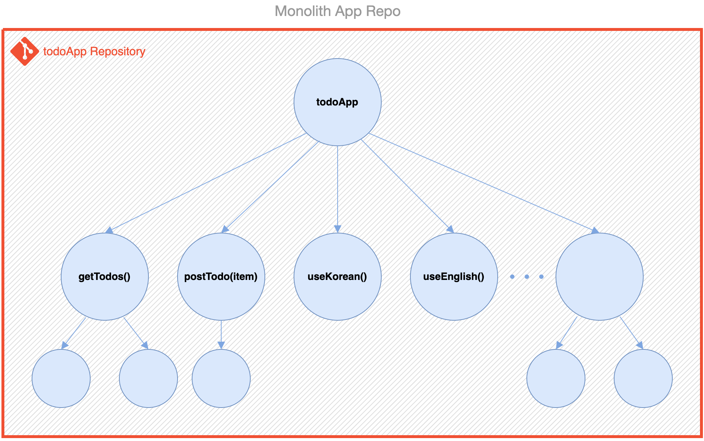
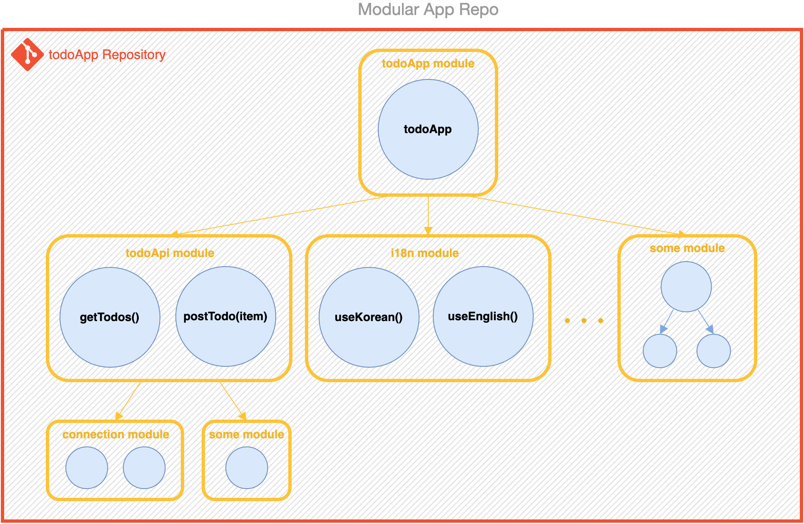
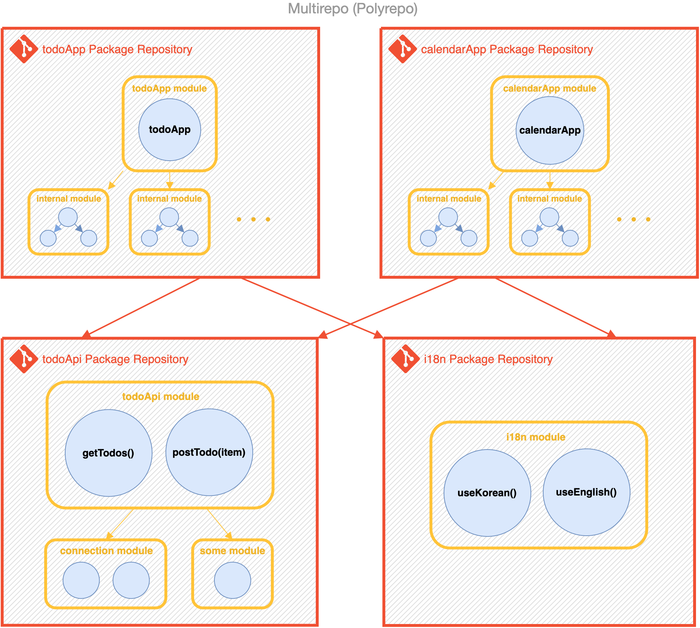
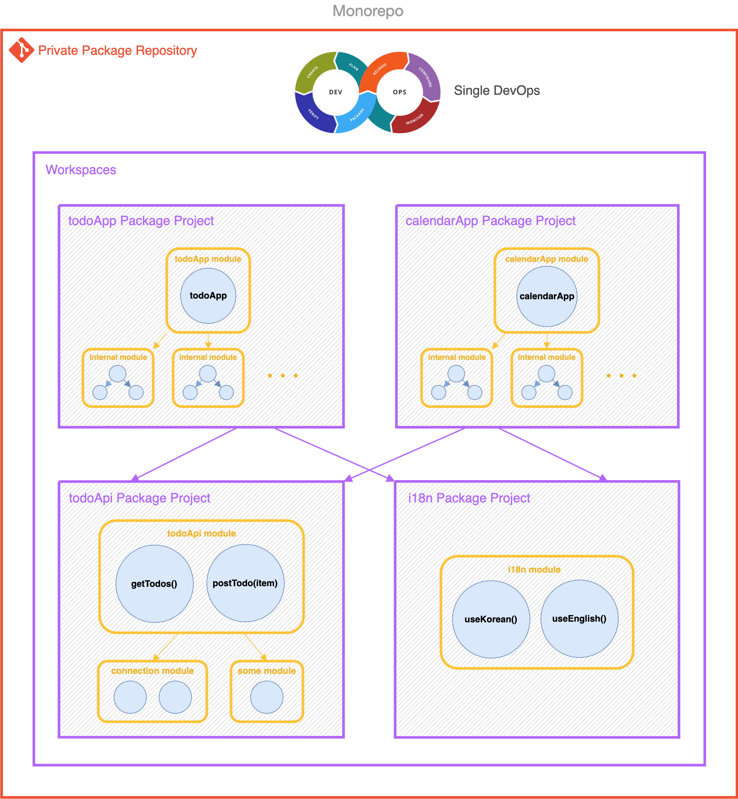

# monorepo

## 모노레포의 등장 배경

위키백과에 따르면 모노레포의 정의는 다음과 같습니다.

> 모노레포란 버전 관리 시스템에서 두 개 이상의 프로젝트 코드가 동일한 저장소에 저장되는 소프트웨어 개발 전략

이 개발 전략은 고전적 소프트웨어 개발 방식인 모놀리식 애플리케이션(monolithic application)의 한계에 대한 비판에서 출발된다고 합니다.

**그렇다면 모놀리식 애플리케이션의 한계는**
>"소프트웨어 엔지니어링에서 모놀리식 애플리케이션은 모듈화 없이 설계된 소프트웨어 애플리케이션을 말한다."

코드가 서로 직접적으로 의존하며 단 하나의 버전으로 관리되면서 관심 분리(separation of concerns)가 어려워지고, 설계, 리팩터링, 배포 등의 작업을 매번 거대한 단위로 처리해야 하므로 개발상 많은 제약과 비효율이 있을 것이다.

## 모듈화와 재사용성

이러한 모놀리식 구조의 한계는 모듈화(modularity)를 통해 해결할 수 있다. 일반적으로 모듈식 프로그래밍(modular programming)은 **애플리케이션 로직의 일부를 재사용할 수 있도록 지원**하고 전체 교체 없이 애플리케이션의 **일부를 수정 또는 교체**할 수 있게 해 유지 관리를 용이하게 한다.

그렇다면 이렇게 만든 모듈들을 **다른 애플리케이션에서 사용**되게 할려면 해당 모듈을 위한 독자적인 저장소가 있다면 좀 더 관리하기 쉬울 것이다. 이 구조가 바로 **멀티레포(multirepo)**다.

## 멀티레포(중요!!)

 멀티레포 구조는 앞선 예시의 분리된 각 모듈은 멀티레포 구조에서 고유한 저장소가 있는 독자적 프로젝트가 된다. 각 프로젝트는 자율성이 높으며 독립적인 개발, 린트, 테스트, 빌드, 게시, 배포 파이프라인이 존재한다.

 

 멀티레포는 현재 대부분의 애플리케이션을 개발하는 표준적인 방법이다. 업계는 팀의 자율성이라는 큰 이유 때문에 이 방식을 선호한다. 팀은 애플리케이션 개발의 라이프사이클을 스스로 결정하기를 원한다.

## 멀티레포의 문제 

- 번거로운 프로젝트 생성

  새로운 공유 패키지를 생성할 때마다 다음과 같이 번거로운 과정을 거쳐야 한다.

  저장소 생성 > 커미터 추가 > 개발 환경 구축 > CI/CD 구축 > 빌드 > 패키지 저장소에 publish

- 패키지의 중복 코드 가능성

  위의 번거로움을 피하기 위해 각 프로젝트에서 공통 구성 요소를 자체적으로 작성한다면, 초기 시간을 아낄 수 있지만 시간이 지날수록 보안 및 품질 관리 부담을 증가시킨다.

- 관리 포인트 증가

  늘어난 프로젝트 저장소의 수만큼 관리 포인트가 늘어난다. 린트, 테스트, 개발 모드 실행, 빌드, 게시, 배포 등의 과정을 저장소의 수만큼 반복해야 한다.

- 일관성 없는 개발자 경험(DX)

  각 프로젝트는 테스트 실행, 빌드, 테스트, 린트, 배포 등을 위해 고유한 명령 집합을 사용한다. 이러한 불일치는 여러 프로젝트에서 사용할 명령을 기억해야 하는 정신적 오버헤드를 만든다.

- 다른 패키지의 변경 사항 파악

  관련 패키지의 변화를 지켜보거나 통지받지 않으면 문제가 발생할 수 있다.

- 교차 저장소의 리팩터링 비용

  관련 패키지의 변화가 있을 때 여러 저장소에 걸쳐 변화를 반영하는 것은 쉬운 일이 아닐 것이다. 또한 이렇게 리팩터링된 각 패키지의 버전은 어떻게 관리해야 할까.

이러한 단점을 해결하기 위해 모노레포가 생겨났다.

## 모노레포가 해결하는 문제

### 모노레포의 특징

모노레포(monorepo) 구조는 두 개 이상의 프로젝트가 동일한 저장소에 저장되는 소프트웨어 개발 전략이다. 앞선 예시의 분리된 모듈들은 모노레포에서 여전히 독자 프로젝트로 존재하지만 저장소는 같은 곳을 사용한다.

모노레포의 또 다른 중요한 특징 중 하나는 **프로젝트 간의 관계**다. 단순히 여러 프로젝트가 하나의 저장소를 사용한다고 해서 모노레포 구조라고 부르기에는 부족하다. 흔히 모노레포에서는 프로젝트 사이에 의존성이 존재하거나 같은 제품군이거나 하는 정의된 관계가 존재한다. 아래에서 소개할 모노레포 관리 도구는 모두 이러한 **관계를 효율적으로 관리해 주는 도구**라고 할 수 있다.

### 모노레포가 해결하는 멀티레포의 문제

- 더 쉬운 프로젝트 생성

  모노레포에서는 저장소 생성 및 커미터 추가 과정이 필요 없고, 개발 환경, CI/CD, 빌드, 게시 등의 과정에 기존 DevOps를 이용하므로 새 프로젝트 생성에 대한 오버헤드가 없다.

- 더 쉬운 의존성 관리

  의존성 패키지가 같은 저장소에 있으므로 버전이 지정된 패키지를 npm registry와 같은 곳에 publish할 필요가 없다

- 단일화된 관리 포인트
  
  개발환경 및 DevOps에 대한 업데이트를 한 번에 반영할 수 있다.

- 일관된 개발자 경험 제공

  애플리케이션을 일관되게 구축하고 테스트할 수 있다. 개발자는 다른 팀의 애플리케이션에 자신 있게 기여하고 변경 사항이 안전한지 확인할 수 있다.

- 프로젝트들에 걸친 원자적 커밋

  커밋할 때마다 모든 것이 함께 작동한다. 변경 사항의 영향을 받는 조직에서 쉽게 변화를 확인할 수 있다.

- 서로 의존하는 저장소들의 리팩터링 비용 감소

  모노레포는 대규모 변경을 훨씬 더 간단하게 만든다. 100개의 라이브러리로 만든 10개의 앱을 리팩터링하고 변경을 커밋하기 전에 모두 작동하는지 확인할 수 있다.

## 그 밖의 모노레포의 특징

- 테스트 및 빌드 범위 최소화

  소스 변경 시 모든 프로젝트를 다시 빌드하거나 다시 테스트하지 않는다. 대신 변경 사항의 영향을 받는 프로젝트만 다시 테스트하고 빌드한다.

## 모노레포의 오해

- 모노레포가 멀티레포보다 항상 나은 방법인가?

  그렇지 않다. 멀티레포의 단점이 모노레포의 장점이고 장단점이 교차하기 때문에 적절한 상황에서 사용해야 한다.

모노레포의 핵심적 특징은 프로젝트 사이의 관계이고, 모노레포가 적절한 상황은 다음과 같다.

- 유사한 제품의 집합
- 여러 프로젝트의 변화를 한눈에 파악해야 할 때
- 호스트 애플리케이션을 플러그인 등으로 확장할 때
- 공통 기능을 재사용하는 관련된 프로젝트의 집합
- 유사한 DevOps로 구성된 프로젝트의 집합

## 모노레포를 구축할 때 고려할 측면

모노레포를 구축하려고 할 때 **관리 용이성**, **속도** 그리고 **프로젝트 구조** 관리 측면

### 관리 측면

- 코드 공유: 서로 다른 프로젝트 간에 쉽게 소스 코드를 공유

- 일관성 있는 도구: 서로 다른 프로젝트들(심지어 서로 다른 프레임워크를 사용하더라도)에서 일관된 개발 경험을 제공

- 스케폴딩: 새로운 프로젝트를 생성할 때 초기 코드를 쉽게 생성

- 프로젝트 제약 및 가시성(visibility): 저장소 내에서 의존 관계를 제한하는 규칙 정의 지원. 예를 들어, 일부 프로젝트를 팀 전용으로 표시하거나 특정 프레임워크을 사용 중임을 기술.

### 속도 측면

- 로컬 캐싱: 같은 머신에서 같은 것을 두 번 빌드하거나 테스트하지 않음

- 분산 캐싱: 다양한 환경에서 캐시 아티팩트를 공유. 즉, 조직 단위로 여러 CI 환경에 걸쳐 같은 것을 두 번 빌드, 테스트하지 않음

- 로컬 작업 오케스트레이션: 빌드 및 테스트 등의 작업을 순서에 맞게 병렬로 실행

- 분산 작업 실행: 단일 시스템에서 실행되어 여러 시스템에 명령을 전달

- 변화에 영향을 받는 프로젝트 감지: 변경의 영향을 받을 수 있는 항목을 결정하여 영향을 받는 프로젝트만 빌드/테스트

### 구조 파악 측면

- 워크스페이스 분석: 추가 구성 없이 주어진 워크 스페이스의 의존성 관계를 분석

- 의존성 그래프 시각화: 프로젝트 및 작업 간의 종속 관계를 시각화

## 모노레포 구축을 도와주는 도구

Lerna, Yarn, npm, pnpm, Nx 등이 많이 사용되었다.

- Yarn
  - React
  - React-router
  - Babel (Yarn Berry)
- Lerna + Yarn
  - Next.js
  - Babel (v7.12.12)
  - Jest
  - Create React App
  - Storybook
  - Vue-cli
  - Nuxt.js
  - Webpack-cli
  - 모든 레퍼런스
- Lerna + Npm
  - Apollo-server
- Nx
  - Storybook
  - FluentUI
  - NgRx
- Turborepo
  - Vercel
  - Lattice
  - TeeSpring
  - MakeSwift
  - On Deck
  - Astro
  - 모든 레퍼런스
- Pnpm
  - Vue 3
  - 모든 레퍼런스