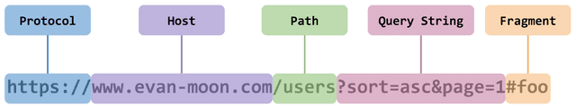
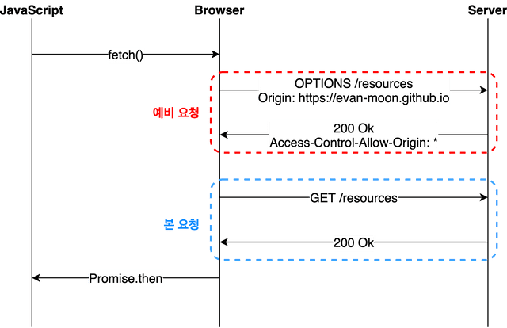

# cors

### 출처

Scheme, Host, port를 합친것이다. 즉 서버의 위치를 찾아내기 위해 필요한 가장 기본적인 것들을 합쳐 놓은 것이다.



출처 내의 포트번호는 생략이 가능하지만, 출처에 포트 번호가 명시적으로 포함되어 있으면 이 포트번호까지 모두 일치해야 같은 출처라고 인정된다.

### SOP(Same-Origin Policy)

동일한 출처 정잭이라고 말한다. 즉 같은 출처에서만 데이터를 공유하는 것을 말한다. 그러나 웹에서 다른 출처에 있는 리소스를 가져와 사용하는 일은 굉장히 흔한 일이라 몇 가지 예외 조항을 두고 허용하고 있는데, 그 중 하나가 'CORS 정책을 지킨 리소스 요청'이다.

### CORS(Cross Origin Resource Sharing)

CORS는 간단하게 말하면 다른 출처를 가진 리소스를 공유하기 위한 정책이다. 우리가 발생하는 CORS는 이러한 정책을 위반 했을 때 일어난다.

### CORS의 동작방식

CORS는 브라우저에 관한 정책이기 때문에 클라이언트에서 외부 api서버로 바로 서버 요청을 보내면 CORS가 발생한다.

즉, 서버에서 서버로 리소스를 요청할 때는 CORS 정책을 위반하지 않고 정상적으로 응답을 받을 수 있다.

그러므로 이와같은 CORS를 해결하는 방법은 아래와 같다.

- 내 api 서버로의 접근에서 CORS 문제가 발생했을 때
  - 해당 api 서버에서 Access-Control-Allow-Origin 헤더에 내 Origin(출처)을 명시한다.
- 외부 api 서버로의 접근에서 CORS 문제가 발생했을 때
  - 브라우저를 통하지 않고(클라이언트에서 외부 서버로 바로 요청을 하지 않고) 프록시 서버에서 외부 서버로 리소스를 요청한다.
  - 프록시 기능을 제공하는 라이브러리를 통해 우회한다.
  - 웹 브라우저 실행 옵션이나 플러그인을 통해 동일 출처 정책(SOP)을 회피한다.
    위와 같은 방법들이 있지만 클라이언트에서 해결하는 CORS는 보통 로컬환경에서만 적용되고 배포 환경에선 적용되지 않기 때문에 서버에서 설정을 해줘야 한다.

### CORS의 동작

#### Simple request

simple 요청은 preflighted 요청을 보내지 않는다. 아래 조건을 모두 만족하면 simple request이다.

- GET요청, HEAD, POST 중 하나의 방법을 사용
- POST 방식일 경우 content-type이 아래 셋 중 하나여야 한다.
  - application/x-www-form-unlencoded
  - multipart/form-data
  - text/plain

simple resuest의 동작은

1. 요청을 보낸다.
2. 브라우저는 Host와 같은 헤더를 추가하는 것 외에도 Origin Request Header를 자동으로 추가한다.

```tsx
GET /products/ HTTP/1.1
Host: api.domain.com
Origin: https://www.domain.com
```

3. 서버에서 origin 리퀘스트 헤더를 확인한다. origin 값이 허용되면 Access-Control-Allow-Origin 요청 헤더를 origin 값으로 설정한다.

```tsx
Http/1.1 200 OK
Access-Control-Allow-Origin: https://www.domain.com
Content-Type: application/json
```

4. 응답을 받은 브라우저는 Access-Control-Allow-Origin 헤더가 탭의 출처와 일치하는지 확인한다.
   Access-Control-Allow-Origin 값이 출처와 정확히 일치하거나, "\*" 와일드카드 연산자를 포함하는 경우 검사를 통과한다.

서버는 요청의 출처에 따라 요청을 허용할지 결정할 수 있다. 브라우저는 Origin 요청 헤더를 정확하게 설정해야 한다.

### Preflighted Request

우리가 가장 많아 사용하는 시나리오이다.
이 때 브라우저는 요청을 한번에 보내지 않고 확인을 위한 예비 요청과 본 요청으로 나누어서 서버로 전송한다.

본 요청을 보내기 전에 보내는 이 예비 요청을 Preflight라고 부르며, 이 요청에는 HTTP 메소드 중 OPTIONS 메소드가 사용된다.
예비 요청은 본 요청을 보내기 전에 브라우저 스스로 이 요청을 보내는 것이 안전한지 확인한다.



1. OPTIONS 메소드를 사용해 ajax 요청을 보낸다.

```tsx
OPTIONS /products/ HTTP/1.1
Host: api.domain.com
Origin: https://www.domain.com
Access-Control-Request-Method: POST
Access-Control-Request-Headers: Authorization, Content-Type
```

2. 서버는 허용된 메소드 및 헤더를 지정해 응답한다.

```tsx
HTTP/1.1 200 OK
Access-Control-Allow-Origin: https://www.domain.com
Access-Control-Allow-Method: GET, POST, OPTIONS, PUT
Access-Control-Allow-Headers: Authorization, Content-Type
Content-Type: application/json
```

3. 헤더와 메소드가 통과되면, 브라우저는 본 CORS 요청을 보낸다.

```tsx
POST /products/ HTTP/1.1
Host: api.domain.com
Authorization: token
Content-Type: application/json
Origin: https://www.domain.com
```

4. Access-Control-Allow-Origin 헤더에 올바른 출처가 있으므로 검사를 통과한다.

### 다른 사람이 만든 프록시 서버 이용하기

요청해야 하는 URL 앞에 프록시 서버 URL 을 붙여 요청하게 되면 해결할 수 있다.

https://cors-anywhere/herokuapp.com

해당 서버를 활용해서 요청을 가로채 HTTP 응답 헤더에 Access-Control-Allow-Origin : \* 를 설정해 주면 된다.

```tsx
axois({
  method:"GET",
  url:`https://cors-anywhere/herokuapp.com/{URL},
  header:{
	'APIKey':'....'
  }
})
```

### 클라이언트 : http-proxy-middleware 사용하기

http-proxy-middleware를 설치한 후에 setupProxy.js라는 파일을 src 폴더 내에 만들고 다음의 코드를 작성해 준다.

```tsx
const {createProxyMiddleware} = require("http-proxy-middleware")

module.exports = function (app) {
  app.use(
    "/api",
    createProxyMiddleware({
      target: "http://localhost:5000",
      changeOrigin::true
    })
  )
}
```
