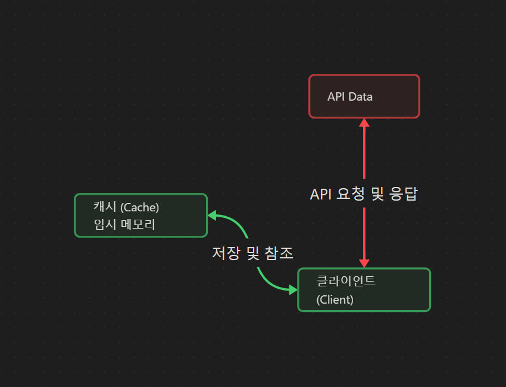
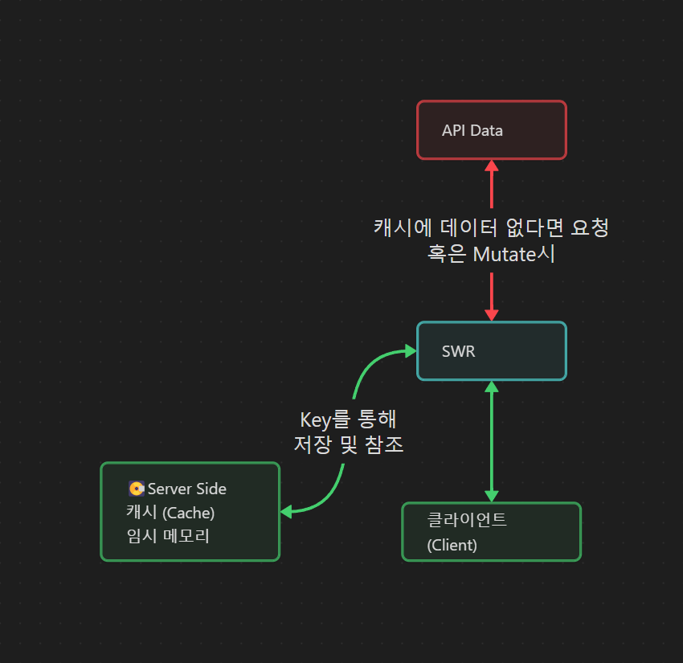

# SWR

### 캐시란?

캐시는 데이터를 일시적으로 저장하는 메모리를 가리키는 용어이다.
한 번의 요청에 비용이 큰 경우, 여러 번 요청을 하는 것 보다, 한 번의 요청 이후 캐시에 저장하여 재사용 하기 위한 전략이다.



### SWR이란?

SWR은 Stale-While-Revalidate의 약자로 HTTP 캐시 무효 전략을 뜻한다.
SWR은 우선적으로 캐시로 부터 데이터를 반환한 후, fetch 요청(Revalidate)이 필요한지 확인하고 요청을 한다.
즉 캐시에 있는 데이터로 처리할 수 있다면, 굳이 요청을 하지 않는다.
그리고 반대로 사용자가 원하는 순간에 요청을 보내 새로 데이터를 받을 수 있다.
이를 통해 컴포넌트는 지속적으로 자동 업데이트 되어 사용자 경험을 향상시킬 수 있다.

SWR 내부에는 Super Cache가 존재한다.
이 객체의 key는 useSWR 훅의 첫 번째 인자로 받은 문자열이고, 이 key를 통해 cache를 만들어 메모리에 저장하고, 데이터를 찾는다.



### SWR 설치

```tsx
# npm
npm i swr
# yarn
yarn add swr
```

### SWR 사용법

#### SWR의 기능

- 빠르고, 가볍게 재사용 가능한 데이터 가져오기.
- 내장된 캐시 및 요청 중복 제거
- 실시간 업데이트로 유저 경험 향상

#### 기본적인 코드

```tsx
import useSWR from 'swr';

const fetcher = (url) => fetch(url).then((r) => r.json()); // fetch 내장 API 사용

function Profile() {
  const { data, error, isLoading } = useSWR('/api/user', fetcher);

  if (error) return <div>failed to load</div>;
  if (isLoading) return <div>loading...</div>;
  return <div>hello {data.name}!</div>;
}
```

useSWR 훅의 첫 인자는 Key로 문자열을 받는다. 이는 고유 식별자로 사용된다.
fetcher는 두 번째 인자로, 함수를 받는다. 이 함수는 Key 문자열을 인자로 받는다. 이는 비동기 함수가 될 수도 있고 fetch API 혹은 Axios와 같은 라이브러리를 사용할 수 있습니다.

#### Bound Mutate

Bound Mutate는 현재 사용중인 useSWR 훅을 기반으로 데이터를 변경할 수 있다.

```tsx
import useSWR from 'swr';

function Profile() {
  const { data, mutate } = useSWR('/api/user', fetcher);

  const handler = async () => {
    const newName = data.name.toUpperCase();
    mutate({ ...data, name: newName }, false);
    await requestUpdateUsername(newName);
  };

  return (
    <div>
      <h1>My name is {data.name}.</h1>
      <button onClick={handler}>Uppercase my name!</button>
    </div>
  );
}
```

mutate를 통해 캐시에 존재하는 데이터를 업데이트 할 수 있다.
mutate의 두 번째 인자는 revalidate, 재검증 반환 여부를 나타낸다. 재검증이란 refetch, 새로 데이터를 받아오는 형식으로 생각하면 된다.

```tsx
mutate({ ...data, name: newName }, false);
mutate({ ...data, name: newName }, true);
```

true일 경우, 재검증을 하여 데이터를 API로 부터 요청하게 되고, false일 경우 UI상의 데이터만 변경될 뿐, 데이터를 재 요청하지 않는다.
유저는 변경된 값을 보게 될 수 있으므로 유저 경험이 더욱 좋아지게 되는 것이다.

#### Global Mutate

전역 관리 상태 라이브러리 recoil, zustend 와 같은 기능을 SWR에서도 사용할 수 있다. SWR의 데이터를 전역에서 사용할 수 있다.

Global Mutate는 전역에서 Mutate 할 수 있다.

```tsx
import { useSWRConfig } from 'swr';

function App() {
  const { mutate } = useSWRConfig();
  mutate(key, data, options);
}
```

```tsx
import { mutate } from 'swr';

function App() {
  mutate(key, data, options);
}
```

위와 같이 두가지 형식으로 가져올 수 있다.
key 값은 useSWR의 첫 인자로 등록한 URL 문자열을 key값으로 설정한다.
bound mutate와 기능적으로 동일하나, key값으로 원하는 데이터에 접근할 수 있는 기능을 가지고 있다.

### SWR API Option

#### ex

```tsx
const { data, error, isValidating, mutate } = useSWR(key, fetcher, options);
Parameter;
```

> Parameter
>
> - key: 요청을 위한 고유한 키 문자열(또는 함수 / 배열 / null) (고급 사용법)
> - fetcher: (옵션) 데이터를 가져오기 위한 함수를 반환하는 Promise (상세내용)
> - options: (옵션) SWR hook을 위한 옵션 객체

> return value
>
> - data: fetcher가 이행한 주어진 키에 대한 데이터(로드되지 않았다면 undefined)
> - error: fetcher가 던진 에러(또는 undefined)
> - isValidating: 요청이나 갱신 로딩의 여부
> - mutate(data?, shouldRevalidate?): 캐시 된 데이터를 뮤테이트하기 위한 함수 （상세내용）

> Options
>
> - suspense = false: React Suspense 모드를 활성화 (상세내용)
> - fetcher(args): fetcher 함수
> - revalidateIfStale = true: stale 데이터가 존재할 경우 마운트시에 자동으로 갱신 (상세내용)
> - revalidateOnMount: 컴포넌트가 마운트되었을 때 자동 갱신 활성화 또는 비활성화
> - revalidateOnFocus = true: 창이 포커싱되었을 때 자동 갱신 (상세내용)
> - revalidateOnReconnect = true: 브라우저가 네트워크 연결을 다시 얻었을 때 자동으로 갱신(navigator.onLine을 통해) (상세내용)
> - refreshInterval (상세내용):
>   - 기본적으로는 비활성화: refreshInterval = 0
>   - 숫자 설정 시, 인터벌 폴링
>   - 함수 설정 시, 함수는 최신 데이터를 수신하고 간격을 밀리초 단위로 반환
> - refreshWhenHidden = false: 창이 보이지 않을 때 폴링(refreshInterval이 활성화된 경우)
> - refreshWhenOffline = false: 브라우저가 오프라인일 때 폴링(navigator.onLine에 의해 결정됨)
> - shouldRetryOnError = true: fetcher에 에러가 있을 때 재시도
> - dedupingInterval = 2000: 이 시간 범위내에 동일 키를 사용하는 요청 중복 제거
> - focusThrottleInterval = 5000: 이 시간 범위 동안 단 한 번만 갱신
> - loadingTimeout = 3000: onLoadingSlow 이벤트를 트리거 하기 위한 타임아웃
> - errorRetryInterval = 5000: 에러 재시도 인터벌
> - errorRetryCount: 최대 에러 재시도 수
> - fallback: 다중 폴백 데이터의 키-값 객체 (예시)
> - fallbackData: 반환될 초기 데이터(노트: hook 별로 존재)
> - onLoadingSlow(key, config): 요청을 로드하는 데 너무 오래 걸리는 경우의 콜백 함수(loadingTimeout을 보세요)
> - onSuccess(data, key, config): 요청이 성공적으로 종료되었을 경우의 콜백 함수
> - onError(err, key, config): 요청이 에러를 반환했을 경우의 콜백 함수
> - onErrorRetry(err, key, config, revalidate, revalidateOps): 에러 재시도 핸들러
> - compare(a, b): 비논리적인 리렌더러를 회피하기 위해 반환된 데이터가 변경되었는지를 감지하는데 사용하는 비교 함수. 기본적으로 dequal을 사용
> - isPaused(): 갱신의 중지 여부를 감지하는 함수. true가 반환될 경우 가져온 데이터와 에러는 무시합니다. 기본적으로는 false를 반환
> - use: 미들웨어 함수의 배열 (상세내용)
> - 느린 네트워크(2G, <= 70Kbps)에서는, 기본적으로 errorRetryInterval이 10초이며, loadingTimeout은 5초
