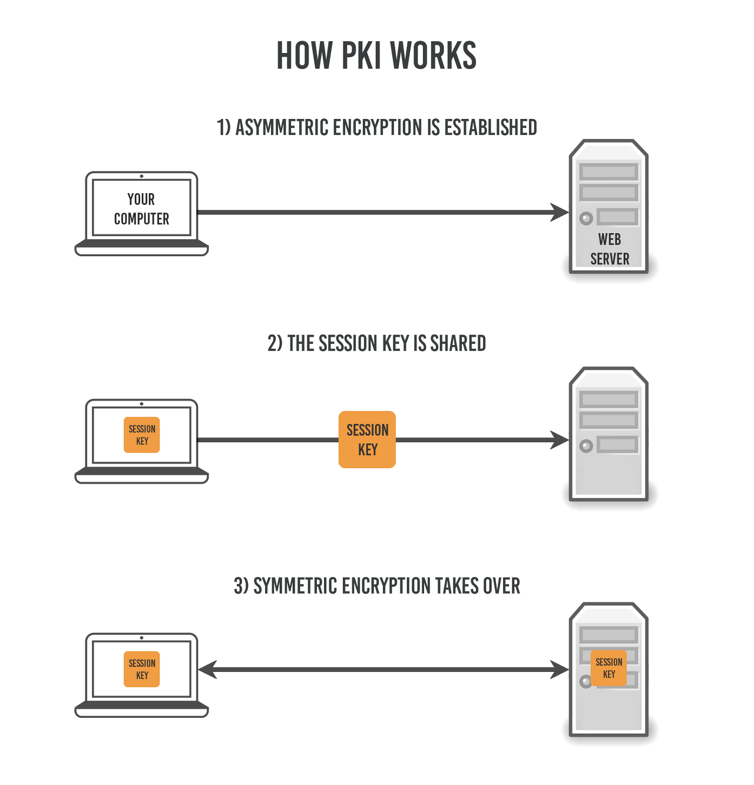

# HTTP vs HTTPS

### HTTP(Hyper Text Transfer Protocol)란?

HHTP란 서버/클라이언트 모델을 따라 데이터를 주고 받기 위한 프로토콜이다.
즉 HTTP는 인터넷에서 하이퍼텍스트를 교환하기 위한 통신 규약으로, 80번 포트를 사용하고 있다. 즉 HTTP 서버가 80번 포트에서 요청을 기다리고, 클라이언트는 80번 포트로 요청을 보내게 된다.

### HTTP의 구조

HTTP는 애플리케이션 레벨의 프로토콜로 TCP/IP 위에서 작동한다. HTTP는 상태를 가지고 있지 않는 Stateless 프로토콜이며 Method, Path, Version, Headers, Body 등으로 구성된다.

하지만 HTTP는 암호화가 되지 않은 평문 데이터를 전송하는 프로토콜이였기 때문에, HTTP로 비밀번호나 주민등록번호 등을 주고 받으면 제 3자가 정보를 조회할 수 있다는 문제가 있다. 이러한 문제를 해결하고자 HTTPS가 등장하였다.

### HTTPS(Hyper Text Transfer Protocol Secure)란?

HTTPS는 HTTP에서 데이터가 암호화가 추가된 프로토콜이다. HTTPS는 HTTP와 다르게 443번 포트를 사용하며, 네트워크 상에서 중간에 제3자가 정보를 볼 수 없도록 암호화를 지원하고 있다.

#### 대칭키 암호화와 비대칭키 암호화

HTTPS는 대칭키 암호화와 비대칭키 암호화가 있다.

- 대칭키 암호화
  - 클라이언트와 서버가 동일한 키를 사용해 암호화/복호화를 진행
  - 키가 노출되면 매우 위험하지만 연산 속도가 빠르다.
- 비대칭키 암호화
  - 1개의 쌍으로 구성된 공개키와 개인키를 암호화/복호화 하는데 사용
  - 키가 노출되어도 비교적 안전하지만 연산 속도가 느림

#### 비대칭키

비대칭키 암호화는 공개키/개인키 암호화 방식을 이용해 데이터를 암호화하고 있다. 공개키와 개인키는 서로를 위한 1쌍의 키이다.

- 공개키: 모두에게 공개가능한 키
- 개인키: 나만 가지고 알고 있어야 하는 키

암호화를 공개키로 하느냐 개인키로 하느냐에 따라 얻는 효과가 다른데, 공개키와 개인키로 암호화하면 각각 다음과 같은 효과를 얻을 수 있다.

- 공개키 암호화: 공개키로 암호화를 하면 개인키로만 복호화할 수 있다. -> 개인키는 나만 가지고 있으므로, 나만 볼 수 있다.
- 개인키 암호화: 개인키로 암호화하면 공개키로만 복호화할 수 있다. -> 공개키는 모두에게 공개되어 있으므로, 내가 인증한 정보임을 알려 신뢰성을 보장 할 수 있다.

### HTTPS의 동작 과정

HTTPS는 대칭키 암호화와 비대칭키 암호화를 모두 사용하여 빠른 연산 속도와 전정성을 모두 얻고 있다.
HTTPS 연결 과정에서는 먼저 서버와 클라이언트 간에 세션키를 교환한다. 여기서 세션키는 주고 받는 데이터를 암호화하기 위해 사용되는 대칭키이며, 데이터 간의 교환에는 빠른 연산 속도가 필요하므로 세션키는 대칭키로 만들어진다.
문제는 이 세션키를 클라이언트와 서버가 어떻게 교환할 것이냐 인데, 이 과정에서 비대칭키가 사용된다.
즉 처음 연결을 성립하여 안전하게 세션키를 공유하는 과정에서 비대칭키가 사용되는 것 이고, 이후에 데이터를 교환하는 과정에서 빠른 연산 속도를 위해 대칭키이가 사용되는 것이다.

실제 HTTPS 연결 과정이 성립되는 흐름을 살펴보면 다음과 같다.

1. 클라이언트가 서버로 최초 연결을 시도 함
2. 서버는 공개키를 브라우저에 넘겨줌
3. 브라우저는 공개키의 유효성을 검사하고 세션키를 발급함
4. 브라우저는 세션키를 보관하며 추가로 서버의 공개키로 세션키를 암호화하여 서버로 전송함
5. 서버는 개인키로 암호화된 세션키를 복호화하여 세션키를 얻음
6. 클라이언트와 서버는 동일한 세션키를 공유하므로 데이터를 전달할 때 세션키로 암호화/복호화를 진행함

