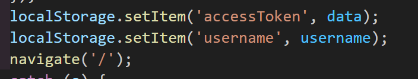

# 웹스토리지란?

### 웹 스토리지와 쿠키의 간단한 차이

웹 스토리지눈 클라이언트에 데이터를 저장할 수 있도록 지원하는 기능으로 웹 스토리지와 쿠키의 기능은 비슷하지만, 쿠키는 약 4KB까지 밖에 저장 공간을 이용하지 못하는 반면에 웹 스토리지는 약 5MB까지 저장 공간을 이용할 수 있다.

이 때 스토리지에는 로컬스토리지와 세션스토리지가 있다.

### 로컬스토리지

로컬 스토리지는 브라우저에 데이터를 저장하며, 브라우저를 종료해도 브라우저에 데이터가 유지된다. 다만 도메인 (domain)이 다른 경우에는 로컬 스토리지에 접근할 수 없다.

### 세션스토리지

세션 스토리지는 각 세션마다 데이터가 각각 저장되며 세션 스토리지는 로컬 스토리지와 다르게 세션을 종료하면 데이터가 자동으로 제거된다. 또 같은 도메인이라도 세션이 다르면 데이터에 접근할 수 없다. 