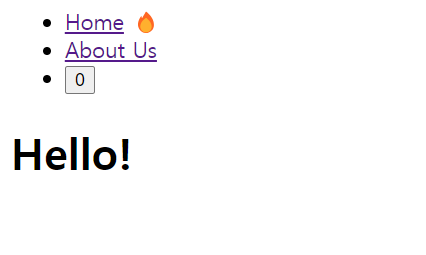
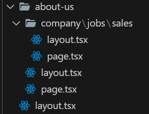

# Layout

### Layout이란?

Layout을 사용하면 반복되는 코드를 줄일 수 있다.

### Layout의 동작 방식

사이트가 로딩되기 전 Next는 Layout에 있는 파일에 들어간다.

그떄 공용으로 사용되는 컴포넌트를 확인하고 출력한다. 다음으로 현재 페이지의 url 파일에 들어가 컴포넌트를 출력한다.

### Layout을 사용하는 방법

#### Navigation

```jsx
export default function Navigation() {
  const path = usePathname();
  const [count, setCount] = useState(0);
  console.log(path);
  return (
    <nav>
      <ul>
        <li>
          <Link href="/">Home</Link> {path === '/' ? '🔥' : ''}
        </li>
        <li>
          <Link href="/about-us">About Us</Link> {path === '/about-us' ? '🔥' : ''}
        </li>
        <li>
          <button onClick={() => setCount((e) => e + 1)}>{count}</button>
        </li>
      </ul>
    </nav>
  );
}
```

#### RootLayout

```jsx
import Navigation from '@/components/navigation';

export const metadata = {
  title: 'Next.js',
  description: 'Generated by Next.js',
};

export default function RootLayout({ children }: { children: React.ReactNode }) {
  return (
    <html lang="en">
      <body>
        <Navigation />
        {children}
      </body>
    </html>
  );
}
```

#### Home

```jsx
import Navigation from '../components/navigation';

export default function Tomato() {
  return (
    <div>
      <h1>Hello!</h1>
    </div>
  );
}
```

만약 Layout이 없다면 아래와 같이 출력된다.


즉 해당 url에 컴포넌트들만 출력된다.

그렇다면 만약 Layout이 있다면



Layout에 들어가 있는 컴포넌트도 같이 출력된다.

### 중첩 Layout

Layout은 서로 덮어지는게 아닌 중첩된다.



위와 같이 사용하면

Root레이아웃에 있는 컴포넌트가 출력되고 특정 페이지의 Layout파일이 있는지 확인한다. 만약 있다면 그 Layout을 출력하고 url의 컴포넌트를 출력한다.