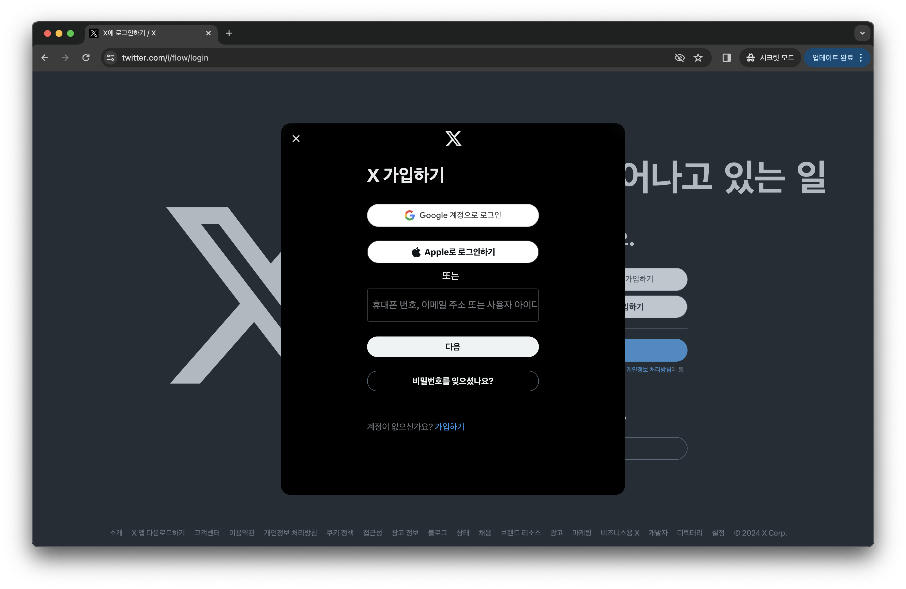
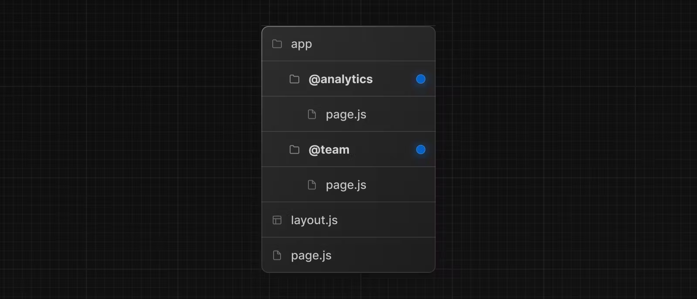
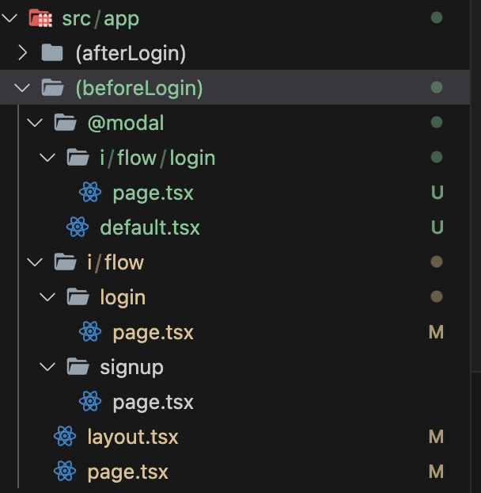
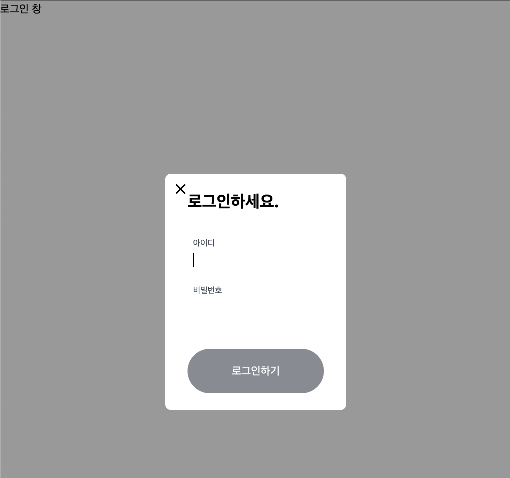
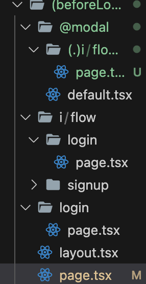

# Parallel Routes & Intercepting Routes

### 사용 예시



위의 이미지를 보면 twitter의 메인 페이지의 화면과 `i/flow/login `의 모달 화면이 동시에 출력되는 것을 볼 수 있다. 이렇듯 우리는 twitter를 클론코딩 할 예정이다.

### parallel routes

하나의 레이아웃에서 여러 페이지를 동시에 보여줄 수 있는 기능이다. `@folderName` 에 의해 생성이 되며, 이렇게 생성된 slot 속 페이지는 slot과 같은 레벨의 레이아웃에 props 로 전달된다.



@analytics 와 @team 이라는 slot 이 생성되는데 이들은 모두 같은 레벨의 레이아웃에 props 로 다음과 같이 전달되어 렌더링된다.

```tsx
export default function Layout({
  children,
  team,
  analytics,
}: {
  children: React.ReactNode;
  analytics: React.ReactNode;
  team: React.ReactNode;
}) {
  return (
    <>
      {children}
      {team}
      {analytics}
    </>
  );
}
```

layout을 이러게 작성하면 위에서 만든 parallel는 {analytics}에 들어가게 된다.

자 이제 다시 트위터로 돌아가면 app router 의 파일 컨벤션에 따라서 app 디렉토리에 다음과 같은 폴더 구조를 생성했다.



@modal 은 props 의 modal로 전달이 되었고, 그 외 요소들은 children로 전달이 되었다.
그 후 매칭되는 라우트에 네비게이션할 때 해당 라우팅의 컴포넌트가 렌더링된다.

그러면 아래와 같은 layout이 구성된다.

```tsx
import { ReactNode } from 'react';

export default function Layout({ children, modal }: { children: ReactNode; modal: ReactNode }) {
  return (
    <div>
      {children}
      {modal}
    </div>
  );
}
```

이제 baseURL/i/flow/login 으로 접속 시 children 부분에는 (beforeLogin)/i/flow/login 이, modal 부분에는 (beforeLogin)/@modal/i/flow/login이 출력된다. 하지만 baseUrl로 접속시 children 부분에는 page.tsx 가 출력되고 modal 부분에는 default.tsx 가 출력된다. (@modal/page.tsx 부재를 default.tsx 가 대체)

> default.tsx → parallel route 의 default page. parallel route 가 이용되지 않을 때 이 페이지를 디폴트값으로 띄워줍니다. 즉, 라우팅이 unmatched 할 때 이 페이지를 렌더링합니다. (따라서 위와 같은 상황에 default.tsx 페이지가 없다면 에러가 발생한다.)

#### default.tsx

```tsx
export default function Default() {
  return null;
}
```



하지만 위와 같이 적용하면 하지만 우리가 원하는 것은 i/flow/login/page.tsx 가 동시에 렌더링 된다. 그러나 우리가 원하는 것은 main page(라우팅 주소가 다름)가 뒷배경으로 렌더링 되는 것이다.

### Intercepting routes

intercepting routes 는 현재 페이지 컨텍스트를 유지한 채로 새로운 라우트를 렌더링한다.
따라서 주소가 다른 페이지들을 동시에 렌더링 할 수 있다.

원하는 화면을 구성하기 위해 layout props 로 children 을 page.tsx 로, modal 을 @modal/i/flow/login/page.tsx 로 전달한다.

interception routes 는 (..) 같은 형태가 있다.

> (.) 동일한 라우팅 레벨 세그먼트에 매칭
>
> (..) 부모 라우팅 레벨 세그먼트에 매칭
>
> (..)(..) 2단계 윗 레벨
>
> (…) app 디렉토리 루트 요소에 매칭



구조를 위와 같이 바꿔 intercepting routes 를 사용하면
@modal 요소 컨텍스트는 유지한 채 (브라우저 주소 상)같은 레벨의 i 요소의 라우팅을 인터셉트할 수 있다.
이제 layout.tsx 에 children prop 에 page.tsx 가 렌더링되고, modal prop에 i/flow/login 으로 인터셉트한 기존 모달 부분이 렌더링되어 원하던 결과를 얻을 수 있게 됩다.
