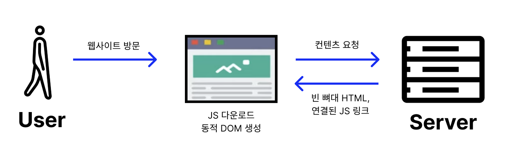
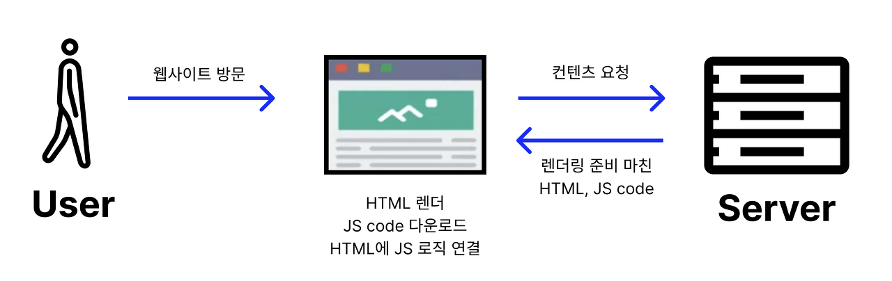
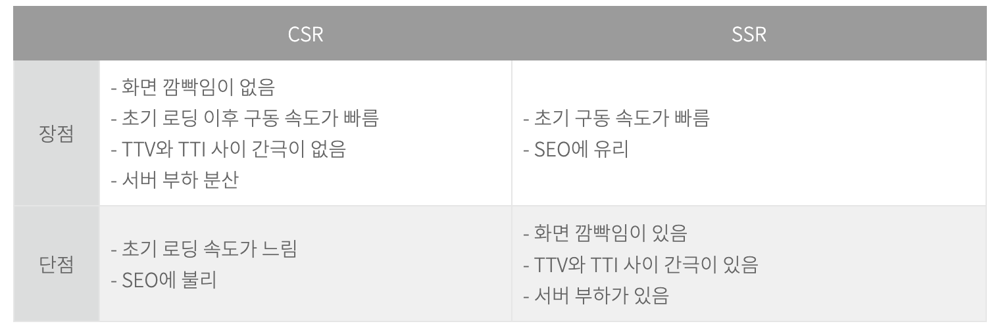

# Rendering

## SPA & MPA

### SPA

SPA는 Single Page Application의 약자로, 하나의 페이지로 구성된 웹 애플리케이션이다. 이렇게 SPA로 개발된 웹 페이지는 무언가를 클릭하면 화면이 변화 할때 클릭하여 동작해야 하는 부분만 바뀌게 하는 웹 구성 방식이다.

### MPA

MPA는 Multi Page Application의 약자로, 화면을 이동할 때 마다 새로운 HTML을 불러와 화면 전체릴 리랜더링 하는 웹 구성 방식이다.

## CSR & SSR

### SPA === CSR & MPA === SSR ?

SPA는 CSR로 렌더링 되고, MPA는 SSR로 렌더링 된다.

- SPA는 웹의 정적 리소스를 한번에 다운로드 하고, 새로운 페이지의 요청이 왔을 때 필요한 데이터만 받아 클라이언트를 갱신한다. 그렇기에 CSR로 렌더링 한다.

- MPA는 새로운 요청이 있을 때 서버에서 이미 렌더링 된 정적 리소스를 받아온다 그렇기에 SSR로 렌더링 한다.

위와 같은 이유 때문에 SPA === CSR & MPA === SSR라고 생각하는 사람이 많지만 전혀 다른 개념이다.

### CSR과 SSR 개념

CSR(Client Side Rendering)은 클라이언트에서 렌더링 하는 방식이다. SSR은(Server Side Rendering)으로 서버에서 렌더링 하는 방식이다.

### CSR의 동작



> 1.  유저가 웹사이트에 방문하면, 브라우저가 서버에 콘텐츠를 요청한다.
> 2.  이에 서버는 빈 뼈대만 있는 HTML을 응답으로 보내준다.
> 3.  브라우저가 연결된 JavaScript 링크를 통해 서버로부터 다시 JavaScript 파일을 다운로드한다.
> 4.  JavaScript를 통해 동적으로 페이지를 만들어 브라우저에 띄워준다.

### SSR의 동작



> 1.  유저가 웹사이트에 방문하면, 브라우저가 서버에 콘텐츠를 요청한다.
> 2.  이에 서버는 페이지에 필요한 데이터를 즉시 얻어와 모두 삽입하고, CSS까지 모두 적용해 렌더링 준비를 마친 HTML과 JavaScript코드를 브라우저에 응답으로 전달한다.
> 3.  브라우저에서는 JavaScript코드를 다운로드하고 HTML에 JavaScript로직을 연결한다.

### CSR과 SSR의 장단점



### CSR 코드

```tsx
'use client';

import { useEffect, useState } from 'react';

export default function getMovies() {
  const [isLoading, setIsLoading] = useState(true);
  const [movies, setMovies] = useState([]);
  const getMovies = async () => {
    const response = await fetch('https://nomad-movies.nomadcoders.workers.dev/movies');
    const json = await response.json();
    setMovies(json);
    setIsLoading(false);
  };
  useEffect(() => {
    getMovies();
  }, []);
  return <div>{isLoading ? 'Loading...' : JSON.stringify(movies)}</div>;
}
```

CSR을 사용하면 리액트에서 사용용하는 metadata를 사용하지 못한다. 또한 같은 페이지를 제 렌더링 하더라도 로딩이 생긴다.

### SSR코드

```tsx
export const metadata = {
  title: 'Home',
};

const URL = 'https://nomad-movies.nomadcoders.workers.dev/movies';
async function getMovies() {
  await new Promise((resolve) => setTimeout(resolve, 5000));
  console.log('im fetching');
  const response = await fetch(URL);
  const json = await response.json();
  return json;
}

export default async function HomePage() {
  const movies = await getMovies();
  return <div>{JSON.stringify(movies)}</div>;
}
```

위에 적은 CSR과 달리 metadata를 사용할 수 있다. 같은 창을 제랜더링 하더라도 로딩이 오래 걸리지 않는다. 다만 useState, useEffect를 사용하지 못한다. 사용하기 위해선 `'use client';`를 적어줘야한다.
