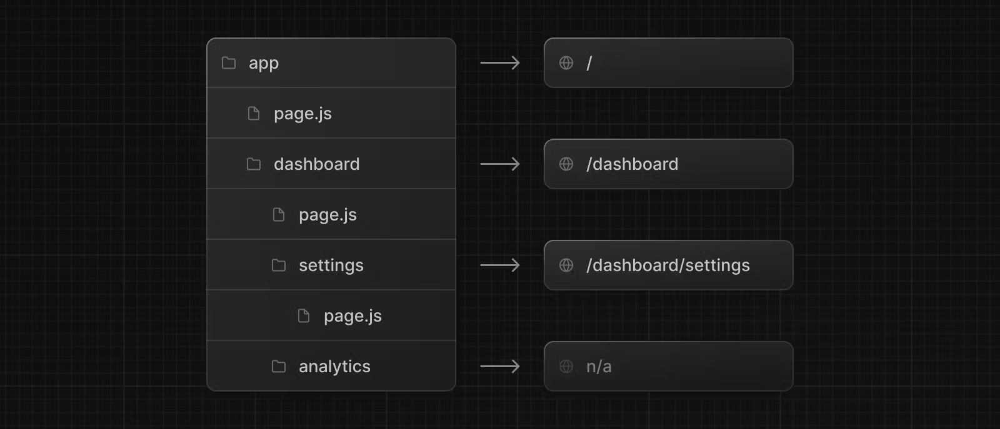

# Routing

### React에서의 라우팅

```jsx
import { BrowserRouter as Router, Routes, Route } from 'react-router-dom';

function App() {
  return (
    <div>
      <Router>
        <Routes>
          <Route path="/" element={<Main />} />
        </Routes>
      </Router>
    </div>
  );
}

export default App;
```

이렇게 페이지의 url와 컴포넌트를 따로 불러와 정의 해줬어야 했다.

## next의 라우팅

### 라우팅 방법

Next.js 애플리케이션에서 라우트를 정의하는 방법은 파일 시스템 기반의 라우터를 사용한다.



위에 보이는 사진 처럼 /dashboard/analyticsURL 경로에 `page.js`라는 파일이 없기 때문에 라우팅 할 수 없다. Nextjs는 파우팅할 페이지의 파일 이름을 `page`로 지어야 한다는 규정이 있다. (js가 아닌 jsx, tsx 등도 사용할 수 있다.) 또한 Next.js에서는 app 폴더 바로 밑에 있는 page.tsx 파일이 '/' 주소에 해당합니다.

### 화면 렌더링

```tsx
import Navigation from '../../components/navigation';

export default function Auth() {
  return (
    <div>
      <Navigation />
      <h1>auth페이지</h1>
    </div>
  );
}
```

이렇게 하면 `/user/auth`로 접속 했을 때 화면이 출력된다.

## 페이지 연결

Next.js에서 페이지간 연결하는 방법은 4가지가 있다.

- 구성요소 사용<Link>
- useRoutergnr 사용 ( 클라이언트 구성 요소 )
- redirect기능 사용 ( 서버 구성 요소 )
- 기본 기록 API 사용

### Link

Link는 Next에서 권장하는 라우팅 방법이다.

#### 기본적인 사용

```tsx
import Link from 'next/link';

export default function Page() {
  return <Link href="/dashboard">Dashboard</Link>;
}
```

#### 동적인 연결

```tsx
import Link from 'next/link';

export default function PostList({ posts }) {
  return (
    <ul>
      {posts.map((post) => (
        <li key={post.id}>
          <Link href={`/blog/${post.slug}`}>{post.title}</Link>
        </li>
      ))}
    </ul>
  );
}
```

### useRouter훅 사용

앱 함수 구성요소 내부에 있는 router개체에 액세스하려는 경우에는 useRouter라는 hooks를 사용한다.

```tsx
'use client';

import { useRouter } from 'next/navigation';

export default function Page() {
  const router = useRouter();

  return (
    <button type="button" onClick={() => router.push('/dashboard')}>
      Dashboard
    </button>
  );
}
```

이런식으로 함수와 결합하여 사용할 수 있다.

### 404 페이지 만들기

`app`폴더 아래에 `not-found.tsx`라는 파일을 만든 후 아래와 같이 사용하면 not-found 페이지를 만들 수 있다.

```tsx

export default function NotFound() {
  return (
    <div>
      <h1>Not found!</h1>
    </div>
  );
}
```
