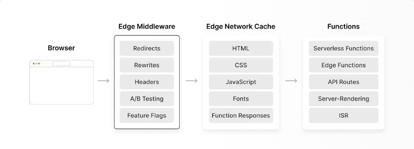

# middleware

### middleware란?

nextjs에서 페이지를 렌더링하기 전에 서버 측에서 실행되는 함수이다.

`Middleware`에서는 `Request` 객체와 `Response` 객체에 접근할 수 있으며

이를 활용해 요청 정보를 받아와 부가적인 처리를 하고 응답객체에 무언가를 추가하거나 응답을 변경할 수 있다.

### 사용하는 경우

1. 페이지 렌더링 전에 인증을 확인하거나 요청을 확인한다.
2. 요청 데이터를 사전에 처리하거나 특정 API요청을 수행하거나 캐시를 관리한다.
3. 요청에 대한 응답을 변환하거나 에러를 처리할 수 있다.

### 특징

캐시된 페이지보다 먼저 수행되어 정적 파일과 페이지를 개인화할 수 있어 위와 같은 사례에서 활용된다고 한다.



Vercel 공식문서에 따르면 미들웨어는 웹사이트에서 요청이 처리되기 전에 실행되며 Vercel 환경에서는 특이하게도 캐시보다 먼저 수행된다고 한다.

### 사용법

page 폴더와 같은 경로에 생성한다. (middleware.ts)

```tsx
// middleware.ts
import { NextResponse } from 'next/server';
import type { NextRequest } from 'next/server';

// This function can be marked `async` if using `await` inside
export function middleware(request: NextRequest) {
  return NextResponse.redirect(new URL('/about-2', request.url));
}

// See "Matching Paths" below to learn more
export const config = {
  matcher: '/about/:path*',
};
```

### Matcher

`config`의 `matcher`를 설정하여 원하는 경로에 미들웨어를 적용한다.

```tsx
export const config = {
  matcher: [
    /*
     * Match all request paths except for the ones starting with:
     * - api (API routes)
     * - _next/static (static files)
     * - _next/image (image optimization files)
     * - favicon.ico (favicon file)
     */
    '/((?!api|_next/static|_next/image|favicon.ico).*)',
  ],
};
```

위의 코드는 모든 경우에 middleware를 사용하는 경우에 대한 코드이다.

### jwt 확인 예제

```tsx
import { NextRequest, NextResponse } from 'next/server';

export function middleware(request: NextRequest) {
  const { cookies } = request;
  const hasCookie = cookies.has('accessToken');
  if (!hasCookie && request.nextUrl.pathname !== '/') {
    return NextResponse.redirect(new URL('/', request.nextUrl.origin));
  }
  if (hasCookie && request.nextUrl.pathname === '/') {
    return NextResponse.rewrite(new URL('/me/categories', request.nextUrl.origin));
  }
  return NextResponse.next();
}

export const config = {
  matcher: ['/me/:path*', '/write/:path*', '/'],
};
```
