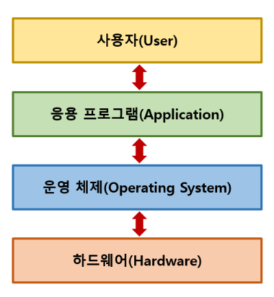

# os

### 운영체제(OS)

운영체제(OS, Operating System)는 컴퓨터 시스템의 핵심 소프트웨어로, 컴퓨터 하드웨어와 응용 프로그램 간의 상호작용을 관리하고 제어하는 역할을 한다.

운영체제의 목적은 사용자와 하드웨어 사이의 인터페이스를 제공해 효율적으로 응용 프로그램이 동작하도록 지원하고, 시스템 자원을 효율적으로 관리하여 응용 프로그램이 원활하게 동작할 수 있도록 한다.

운영체제의 코어(핵심) 부분을 커널(Kernel)이라고 하는데, 일반적으로는 커널에 여러가지 기능(라이브러리, 시스템 프로그램 등등)이 추가된 상태를 통칭해서 운영체제(OS)라고 한다.

### 운영체제의 역할

- 자원 관리

운영체제는 컴퓨터 시스템의 하드웨어 자원을 효율적으로 관리하는 역할을 한다. CPU(중앙처리장치), 메모리(Memory), 저장장치(Storage), 입출력 장치(I/O Device) 등 하드웨어의 자원을 할당하고 관리하여 여러 응용 프로그램이 동시에 실행될 수 있도록 한다.

- 메모리 관리

운영체제는 컴퓨터의 메모리를 효율적으로 관리하여 응용 프로그램이 필요로하는 메모리 공간을 할당한다. 여기서 메모리의 할당과 해제, 가상 메모리 관리 등을 포함한다.

- 프로세스 관리

운영체제는 실행 중인 응용 프로그램인 프로세스(Process)를 관리한다. 여기서 프로세스의 생성, 실행, 일시 정지, 시스템 중지 등의 작업을 제어하며, 여러 프로세스 간의 자원 공유와 협력을 관리한다.

- 디스크 및 파일 시스템 관리

운영체제는 디스크와 파일 시스템을 관리하여 파일의 생성, 삭제, 복사, 이동 등의 작업을 처리한다. 파일 시스템은 데이터의 영구적인 저장과 접근을 제공하여 사용자 및 응용 프로그램이 데이터를 쉽게 관리할 수 있도록 한다.

- 입출력 관리

운영체제는 입출력 장치와의 상호작용을 관리한다. 사용자와 응용 프로그램이 키보드, 마우스, 디스플레이, 프린터 등과의 통신을 할 수 있도록 지원하며, 입출력 장치의 성능을 최적화 한다.

- 사용자 인터페이스

운영체제는 사용자와 컴퓨터 간의 상호작용을 지원하는 사용자 인터페이스를 제공한다. 텍스트 기반의 터미널 환경(CLI, Command Line Interface)과 그래픽 사용자 환경(GUI, Graphical User Interface)을 통해 사용자가 컴퓨터를 조작할 수 있도록 한다.

- 네트워킹

운영체제는 컴퓨터 네트워크를 관리하고, 네트워크 프로토콜을 지원하여 컴퓨터 간의 통신을 가능하게 한다. 인터넷 연결, 데이터 전송, 네트워크 보안 등을 관리한다.

- 오류 처리

운영체제는 시스템 내부 또는 외부에서 발생하는 오류와 예외 상황을 처리한다. 여기서 프로세스의 비정상 종료, 메모리 오버플로우, 입출력 오류 등을 감지하고 처리하여 시스템의 안정성과 신뢰성을 유지한다.

- 시스템 보안

운영체제는 시스템의 보안을 유지하기 위해 접근 제어, 사용자 인증, 암호화 등의 기능을 제공한다. 여기서 불법적인 접근과 데이터 유출 등으로부터 시스템을 보호하고 안전한 환경을 제공한다.

### 운영체제 종류

- 윈도우(windows) : microsoft사에서 개발한 운영체제로, 노트북 및 서버 시스템에서 주로 사용된다.

- macOS : Apple사에서 개발한 운영체제로, mac 컴퓨터 및 노트북에서 사용된다. 시스템 안정성과 사용자 편의성에 중점을 둔 운영체제다.

- 리눅스(Linux) : 오픈 소스 운영체제로, 다양한 배포판이 있다. 서버 시스템 및 임베디드 시스템에서 주로 사용되며, 안정성과 보안성이 높은 운영체제다.

- 유닉스(UNIX) : 다중 사용자 및 다중 작업을 지원하는 운영체제로, 서버 환경에서 주로 사용된다. 안정성과 신뢰성이 높다.
