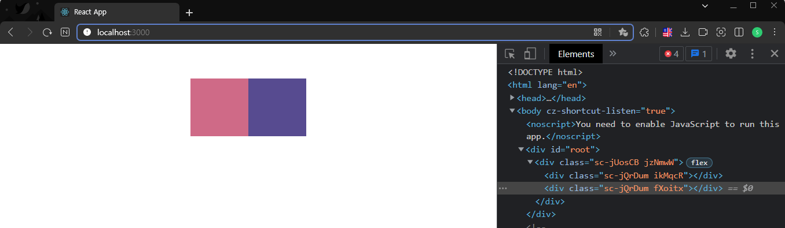
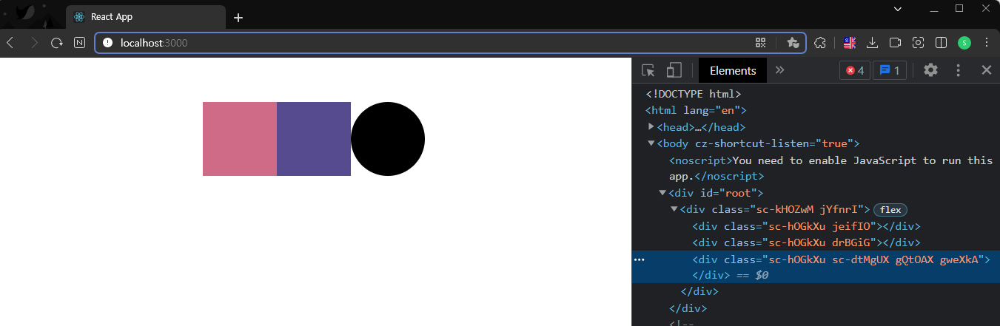
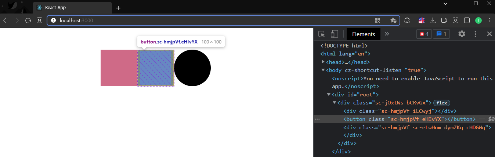

# styled-components

```styled-componets```는 웹페이지를 HTML, CSS, JavaScript 3개로 분리하는 것이 아니라, 여러 개의 컴포넌트로 분리하고, 각 컴포넌트에 HTML, CSS, JavaScript를 몽땅 때려 박는 패턴이 많이 사용되고 있는데 이때 css를 js에 삽입할 때 사용된다.

### styled-components 설치

#### npm
```jsx
$ npm i styled-components
```

#### yarn
```
$ yarn add styled-components
```

<hr/>

### 기본 문법

```styled-components``` 패키지에서 ```styled``` 함수를 임포트한다

```jsx
import styled from "styled-components";
```

기본적으로 html의 모든 태그들에 스타일을 적용할 수 있다. 적용 방법은 ```styled.tagName```과 같이 작성한 뒤, 적용하고자 하는 CSS 스타일을 작성하면 된다.

```jsx
import styled from "styled-components";

const Wrapper = styled.div`
  display: flex;
  justify-content: center;
  align-items: center;                        //배경 컨테이너
  width: 100%;
  height: 15vh;
`;

const BoxOne = styled.div`
  background-color: #cf6a87;                  //첫번째 블록
  width: 100px;
  height: 100px;
`;

const BoxTwo = styled.div`
  background-color: #574b90;                  //두번째 블록 
  width: 100px;
  height: 100px;
`;

const App = () => {
  return (
    <Wrapper>
      <BoxOne />
      <BoxTwo />
    </Wrapper>
  );
};

export default App;
```



<hr/>

### 확장하기

```BoxOne```, ```BoxTwo```는 각각 배경색을 제외하고는 중복된 코드를 가지고 있기 때문에 
Styled Components에서는 props를 통해 각각의 컴포넌트마다 원하는 속성을 적용할 수 있게 해준다.

``` jsx
... 생략

const Box = styled.div`
  background-color: ${(props) => props.bgColor};
  width: 100px;
  height: 100px;
`;

const App = () => {
  return (
    <Wrapper>
      <Box bgColor={"#cf6a87"} />
      <Box bgColor={"#574b90"} />
    </Wrapper>
  );
};
```

<hr/>

### 상속

이번에는 Box 컴포넌트와 같은 크기를 가진 Circle 컴포넌트를 만들어볼거다.

```jsx
const Circle = styled.div`
  background-color: ${(props) => props.bgColor};
  width: 100px;
  height: 100px;
  border-radius: 50%;
`;

const App = () => {
  return (
    <Wrapper>
      <Box bgColor={"#cf6a87"} />
      <Box bgColor={"#574b90"} />
      <Circle bgcolor={"black"} />
    </Wrapper>
  );
};
```

border-radius 속성을 제외하고는 Box 컴포넌트와 다를게 없다. Styled Components에서는 이러한 코드의 중복을 막기 위해서 html의 태그 뿐만 아니라, Styled Components를 통해 만든 컴포넌트도 다시 정의하여 사용할 수 있다 차이점이라면 styled(ComponentName)와 같이 컴포넌트 명을 괄호 안에 넣어줘야 한다는 것 하나뿐이다.

``` jsx
const Box = styled.div`
  background-color: ${(props) => props.bgColor};
  width: 100px;
  height: 100px;
`;

const Circle = styled(Box)`     // 기본적인 Box의 스타일을 가지고 오고 bordre-radius만 50%로 바꿈
  border-radius: 50%;
`

const App = () => {
  return (
    <Wrapper>
      <Box bgColor={"#cf6a87"} />
      <Box bgColor={"#574b90"} />
      <Circle bgColor={"black"} />
    </Wrapper>
  );
};
```



<hr/>

### as 속성

```Box```가 너무 예뻐서 다른 곳에서 버튼으로도 사용하고 싶어질 수가 있다..! 하지만 ```Box```는 div로 정의되어 있고, 원래의 ```Box```와 동시에 사용하면서 중복되는 코드도 만들고 싶지 않다.

그럴 때는 아주 간단하게 컴포넌트의 태그에 ```as``` 속성을 추가해주면 된다.

``` jsx
const App = () => {
  return (
    <Wrapper>
      <Box bgColor={"#cf6a87"} />
      <Box as="button" bgColor={"#574b90"} />
      <Circle bgColor={"black"} />
    </Wrapper>
  );
};
```



<hr/>

### 속성추가

Styled Components에서는 html 태그의 속성도 지정할 수가 있다.

``` jsx
const Input = styled.input.attrs({ required:true })`
    background-color: orange;
    margin-right: 5px;
`;
```

만약에 여러 속성을 주고 싶다면, 다음과 같이 사용하면 된다.

``` jsx
const Input = styled.input.attrs({ required:true, maxLength:10 })`
    background-color: orange;
    margin-right: 5px;
`;
```


<hr/>

### 애니메이션

Styled Components를 통해 애니메이션을 넣기 위해서는 keyframes를 import 해야 한다.

``` jsx
import {keyframes} from "styled-components";
```

Circle의 색이 바뀌는 애니메이션

``` jsx
import {keyframes} from "styled-components";

const CircleAnimation = keyframes`
  0% {
    background-color:red;
  }
  33% {
    background-color:green;
  }
  66%
  {
    background-color:blue;
  }
  100% {
    background-color:red;
  }
`;

const Circle = styled(Box)`
  border-radius: 50%;
  animation: ${CircleAnimation} 3s linear infinite;
`;

const App = () => {
  return (
    <Wrapper>
      <Circle bgColor={"red"} />
    </Wrapper>
  );
};
```

주의해야 할 점은, 애니메이션을 컴포넌트보다 먼저 정의해주어야 성공적으로 애니메이션이 적용된다.