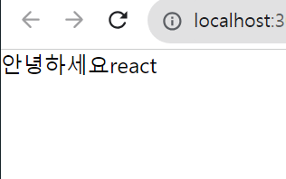
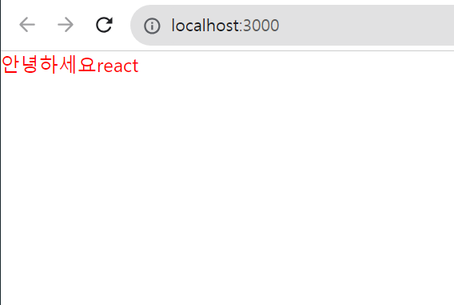
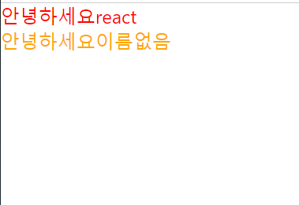

# props를 통해 컴포넌트에게 값 전달하기

### props의 사용법
App 컴포넌트에서 Hello 컴포넌트를 사용 할 때 name 이라는 값을 전달해주고 싶다면

#### App.js
```JSX
import React from 'react';
import Hello from './Hello';

function App() {
  return (
    <Hello name="react" />
  );
}

export default App;
```

#### Hello.js
``` JSX
import React from 'react';

function Hello(props) {
  return <div>안녕하세요 {props.name}</div>
}

export default Hello;
```




### 여러개의 props, 비구조화 할당

Hello 컴포넌트에 이번에는 color라는 값을 추가로 넣어주면 

#### App.js

``` JSX
import React from 'react';
import Hello from './Hello';

function App() {
  return (
    <Hello name="react" color="red"/>
  );
}

export default App;
```
다음으로 Hello 컴포넌트에서 color 값을 조회해서 폰트의 색상으로 설정

#### Hello.js

``` JSX
import React from 'react';

function Hello(props) {
  return <div style={{ color: props.color }}>안녕하세요 {props.name}</div>
}

export default Hello;
```

이러한 코드를 비구조화 할당을 하면 더욱 간결하게 만들 수 있는데 

#### Hello.js

``` JSX
import React from 'react';

function Hello({ color, name }) {     //중괄호 필요
  return <div style={{ color }}>안녕하세요 {name}</div>
}

export default Hello;
```




### defaultProps 로 기본값 설정
컴포넌트에 props 를 지정하지 않았을 때 기본적으로 사용 할 값을 설정하고 싶다면 컴포넌트에 defaultProps 라는 값을 설정하면 된다.

#### Hello.js
``` JSX
import React from 'react';

function Hello({ color, name }) {
  return <div style={{ color }}>안녕하세요 {name}</div>
}

Hello.defaultProps = {
  name: '이름없음'
}

export default Hello;
```

#### App.js
``` JSX
import React from 'react';
import Hello from './Hello';

function App() {
  return (
    <>
      <Hello name="react" color="red"/>
      <Hello color="orange"/>
    </>
  );
}

export default App;
```



### props.children

컴포넌트 태그 사이에 넣은 값을 조회하고 싶을 때 사용한다.

#### Wrapper.js

``` JSX
import React from 'react';

function Wrapper() {
  const style = {
    border: '2px solid black',
    padding: '16px',
  };
  return (
    <div style={style}>

    </div>
  )
}

export default Wrapper;
```

#### App.js
``` JSX
import React from 'react';
import Hello from './Hello';
import Wrapper from './Wrapper';

function App() {
  return (
    <Wrapper>
      <Hello name="react" color="red"/>
      <Hello color="pink"/>
    </Wrapper>
  );
}

export default App;
```


보이는 것 처럼 전에 만들었던 Hello 컴포넌트가 보이지 않는다 이럴때 props.children를 사용한다

#### Wrapper.js

``` JSX
import React from 'react';

function Wrapper({children}) {
  const style = {
    border: '2px solid black',
    padding: '16px',
  };
  return (
    <div style={style}>
      {children}
    </div>
  )
}

export default Wrapper;
```

