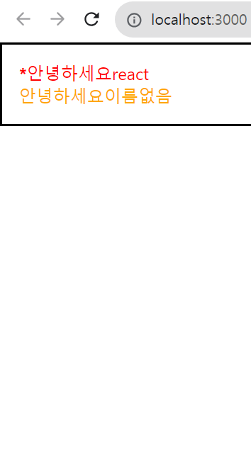

# 조건부 렌더링

조건부 렌더링이란, 특정 조건에 따라 다른 결과물을 렌더링 하는 것을 의미한다.

#### App.js
``` JSX

import React from 'react';
import Hello from './Hello'
import Wrapper from './Wrapper';

function App() {
  return (
    <Wrapper>
    <Hello name="react" color="red" isSpecial={true}/> // 이부분의 true
    <Hello color = "orange"/>
    </Wrapper>
  );  
}

export default App;

```

ture는 js이기 떄문에 중괄호로 감쌈 <br/>
그리고, Hello 컴포넌트에서는 isSpecial 이 true 이냐 false 이냐에 따라서 컴포넌트의 좌측에 * 표시를 하게 하면 (약간의 삼항연산자)

#### Hello.js

``` JSX
import React from 'react';

function Hello({color, name, isSpecial}) {
  return <div style={{color}}>
    {isSpecial ? <b>*</b> : null}
    안녕하세요{name}
    </div>
}

Hello.defaultProps = {
  name: '이름없음'
}

export default Hello;
```



보통 삼항연산자를 사용한 조건부 렌더링을 주로 특정 조건에 따라 보여줘야 하는 내용이 다를 때 사용하지만 지금은 이 경우가 아니기 때문에 &&를 사용해 바꾸면 

#### Hello.js
``` JSX
import React from 'react';

function Hello({color, name, isSpecial}) {
  return <div style={{color}}>
    {isSpecial && <b>*</b>}
    안녕하세요{name}
    </div>
}

Hello.defaultProps = {
  name: '이름없음'
}

export default Hello;
```


```isSpecial && <b>*</b>``` 의 결과는 isSpecial 이 false 일땐 false 이고, isSpecial이 true 일 땐 ```<b>*</b>``` 가 된다


### props 값 설정을 생략하면 ={true}
컴포넌트의 props 값을 설정하게 될 때 만약 props 이름만 작성하고 값 설정을 생략한다면, 이를 true 로 설정한 것으로 간주한다

#### App.js
``` JSX
import React from 'react';
import Hello from './Hello';
import Wrapper from './Wrapper';

function App() {
  return (
    <Wrapper>
      <Hello name="react" color="red" isSpecial />
      <Hello color="pink"/>
    </Wrapper>
  );
}

export default App;
```