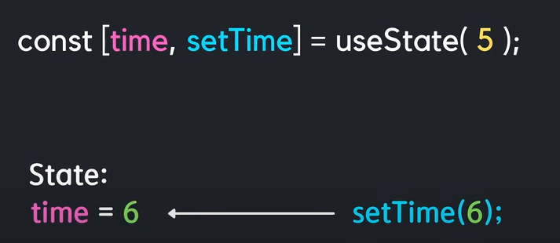
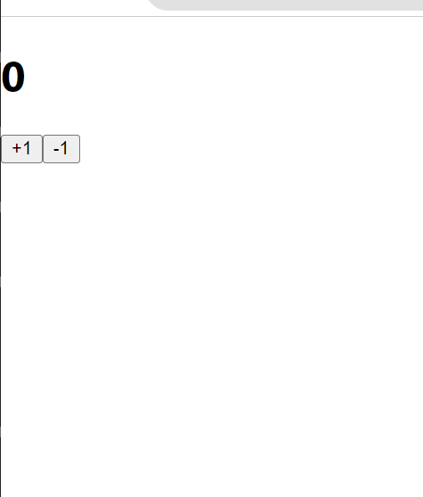

# useState 를 통해 컴포넌트에서 바뀌는 값 관리하기

컴포넌트에서 보여줘야 하는 내용이 사용자 인터랙션에 따라 바뀌어야 할 때 어떻게 구현할 수 있는지

### useState란
```State```란 컴포넌트의 상태를 나타냄 ex) 시계라는 함수가 있다면 ```State```로 현재 시간을 가질 수 있다 <br/> 여기서 useState는 컴포넌트의 상태를 생성하고 업데이트 시켜준다
<br/>
원래 형태는

``` JSX
const [state,setState] = useState(초기값);
```
```useState(초기값)```은 초기값을 생성 <br/>
```state```은 현재의 상태값이 <br/>
```setState```는 값을 변경할 때 사용



### ex)

#### Counter.js

``` JSX
import React from 'react';

function Counter() {
  return (
    <div>
      <h1>0</h1>
      <button>+1</button>
      <button>-1</button>
    </div>
  )
}

export default Counter;
```

### App.js

``` JSX

import React from 'react';
import Counter from './Counter';

function App() {
  return (
    <Counter />
  );  
}

export default App;

```


함수를 만들고, button 의 ```onClick``` 으로 각 함수를 연결해주었다 리액트에서 엘리먼트에 이벤트를 설정해줄때에는 ```on이벤트이름={실행하고싶은함수}``` 형태로 설정 해야한다
여기서 주의 할 점은 함수 형태를 넣어야 한다
```
onClick={onIncrease()}
```
이런식으로 넣으면 안된다

### 동적인 값 끼얹기, useState
컴포넌트에서 동적인 값을 상태(state)라고 부릅니다. 리액트에 ```useState``` 라는 함수가 있는데요, 이것을 사용하면 컴포넌트에서 상태를 관리 할 수 있습니다. 

#### Counter.js
``` JSX
import React, { useState } from 'react';

function Counter() {
  const [number, setNumber] = useState(0)

  const onIncrease = () => {
    setNumber(number + 1)
  }
  const onDecrease = () => {
    setNumber(number - 1)
  }

  return (
    <div>
      <h1>{number}</h1>
      <button onClick={onIncrease}>+1</button>
      <button onClick={onDecrease}>-1</button>
    </div>
  )
}

export default Counter;
```


``` JSX
import React, { useState } from 'react';
```
이 코드는 리액트 패키지에서 ```useState``` 라는 함수를 불러와줍니다

``` JSX
const [number, setNumber] = useState(0);
```

useState 를 사용 할 때에는 상태의 기본값을 파라미터로 넣어서 호출한다 이 함수를 호출해주면 배열이 반환되는데, 여기서 첫번째 원소는 현재 상태, 두번째 원소는 Setter 함수이다

```JSX
const numberState = useState(0);
const number = numberState[0];
const setNumber = numberState[1];
```
원래 형태는 이러한 형태를 가지고 있다


``` JSX
const onIncrease = () => {
    setNumber(number + 1);
  }

  const onDecrease = () => {
    setNumber(number - 1);
  }
```
Setter 함수는 파라미터로 전달 받은 값을 최신 상태로 설정해준다

``` JSX
<h1>{number}</h1>
```
h1 태그에서는 이제 0 이 아닌 {number} 값을 보여주어야 한다


### 함수형 업데이트

지금은 Setter 함수를 사용 할 때, 업데이트 하고 싶은 새로운 값을 파라미터로 넣어주고 있는데, 그 대신에 기존 값을 어떻게 업데이트 할 지에 대한 함수를 등록하는 방식으로도 값을 업데이트 할 수 있다.

#### Counter.js

```JSX
import React, { useState } from 'react';

function Counter() {
  const [number, setNumber] = useState(0);

  const onIncrease = () => {
    setNumber(prevNumber => prevNumber + 1);
  }

  const onDecrease = () => {
    setNumber(prevNumber => prevNumber - 1);
  }

  return (
    <div>
      <h1>{number}</h1>
      <button onClick={onIncrease}>+1</button>
      <button onClick={onDecrease}>-1</button>
    </div>
  );
}

export default Counter;
```

```onIncrease``` 와 ```onDecrease``` 에서 ```setNumber``` 를 사용 할 때 그 다음 상태를 파라미터로 넣어준것이 아니라, 값을 업데이트 하는 함수를 파라미터로 넣어주었다