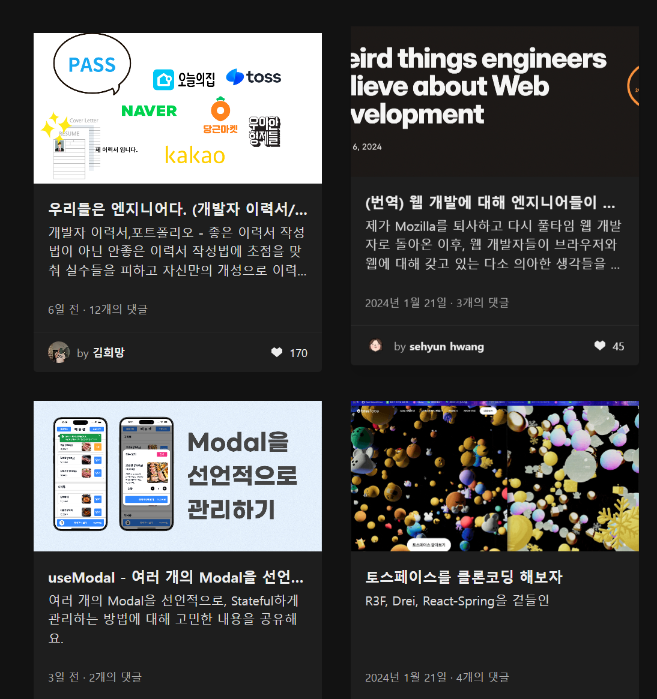
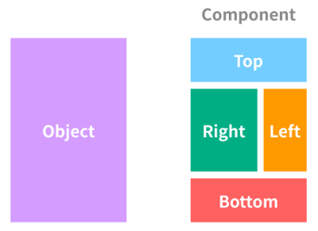

# component

### 컴포넌트란?
컴포넌트란, 재사용이 가능한 각각의 독립된 모듈이다. 
즉 재사용 할 수 있는 블록들과 비슷하다.

예시로 velog의 메인 화면을 보면
똑같은 형태의 블록들이 반복되는 것을 볼 수 있다.

위사진 처럼 컴포넌트를 이용하면 반복적으로 블록을 만드는 것이 아닌 이미 만들어진 컴포넌트들을 조합하여 화면을 구성할 수 있다.

### 컴포넌트의 장점

- 컨텐츠만 다르게 하여 똑같은 UI를 만들 수 있다.
- 만약 하나의 컴포넌트를 만들었다면 그것을 나중에 새로 만드는 것이 아닌 import만을 통해 재활용 할 수 있다.

