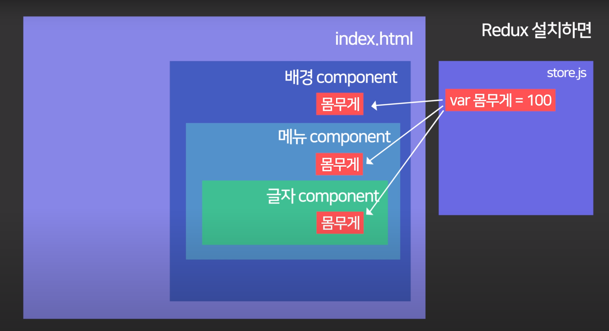
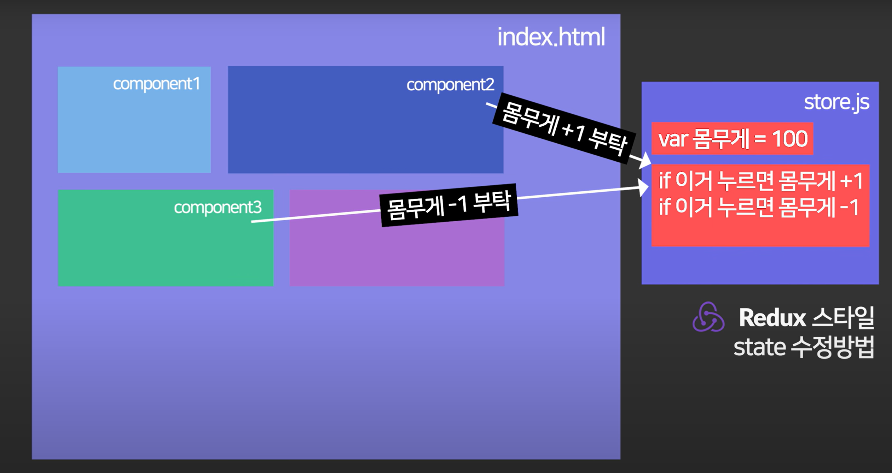

# 리덕스를 쓰는 이유

## props기능을 좀 더 편하게 사용하기 위해
하나 state를 다른 컴포넌트들에도 사용할려면 **props**를 써야 한다. 하지만 리덕스는 이러한 불편함을 해결할 수 있다.

### props와 같은 기능을 쓰는법 
앞서 말한 **state**를 보관하는 js 파일을 만들어 거기에 반복 사용할 **state**를 넣어두면 모든 컴포넌트가 **props**없이 직접 가져다 쓸 수 있다.



## state 변경 관리할 때 
만약 한 파일에 **state**를 보관하고 있는데 **state** 값을 컴포넌트들에서 마음 것 바꾸기 위해서 사용된다.

### state 변경 기능을 쓰는법
**state**밑에 값 수정방법들을 적어주면 된다. 
```
var몸무계 = 100

몸무게 수정방법1  //이거 누르면 몸무게+1
몸무게 수정방법2  //이거 누르면 몸무게-1
```
이제 컴포넌트에서 수정해 달라고 요청을 하는 것이다.



