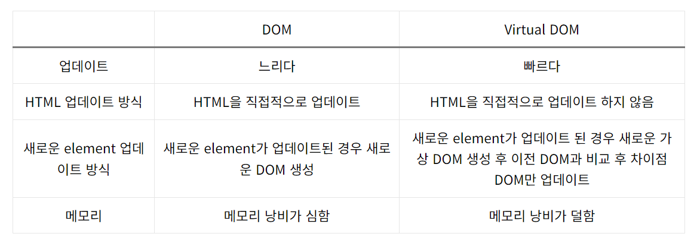

# Virtual-Dom

### DOM(Document Object Model)이란?

웹 페이지나 웹 앱에 있는 HTML 요소들을 구조적으로 표현한 것이다.

DOM은 애플리케이션의 전체 UI를 나타내며 트리 데이터 구조로 표현된다. 웹 개발자가 JavaScript를 통해 콘텐츠를 수정할 수 있기 때문에 매우 유용하다. 또한 구조화된 형식으로 되어 있어 특정 대상을 선택할 수 있고, 모든 코드 작업이 훨씬 쉬워지기 때문에 많은 도움이 된다.

### Dom의 문제점

Dom은 앞서 말한 것 처럼 트리 형태로 되어있어 수정, 대상 선택, 작업 등이 쉽지만 노드의 수가 많아질 수록 속도가 느려지며 업데이트에 있어서도 오류가 발생한다.

또한 최근의 웹슨 SPA(Single Page Application)을 사용하여 HTML 문서 하나에서 모든 동작이 진행이 되는데 이 과정에서 동적인 행동을 지속적으로 재랜더링 하여 무거워진다는 단점도 있다.

또한 DOM의 내용을 수정할 때 

- 브라우저는 HTML을 구문 분석하여 이 ID를 가진 노드를 찾는다.
- 이 특정 요소의 자식 요소를 제거한다.
- 'updated value'으로 요소(DOM)을 업데이트한다.
- 부모 및 자식 노드에 대한 CSS를 다시 계산한다.
- 마지막으로 브라우저 디스플레이에 페인팅된다.

이러한 과정을 거치게 된다.

### Virtual DOM

가상DOM은 실제로 스크린에 랜더링하는 것이 아니기 때문에 DOM을 직접 업데이트하는 것보다 상대적으로 빠르다.

가상 DOM은 실제 DOM에서 처리하는 방식이 아닌 Virtual DOM과 메모리에서 미리 처리하고 저장한 후 실제 DOM과 동기화하는 프로그래밍 개념이다. 해당 DOM을 컴포넌트 단위로 쪼개어 HTML 컴포넌트 조립품 처럼 다루는 개념이다.

