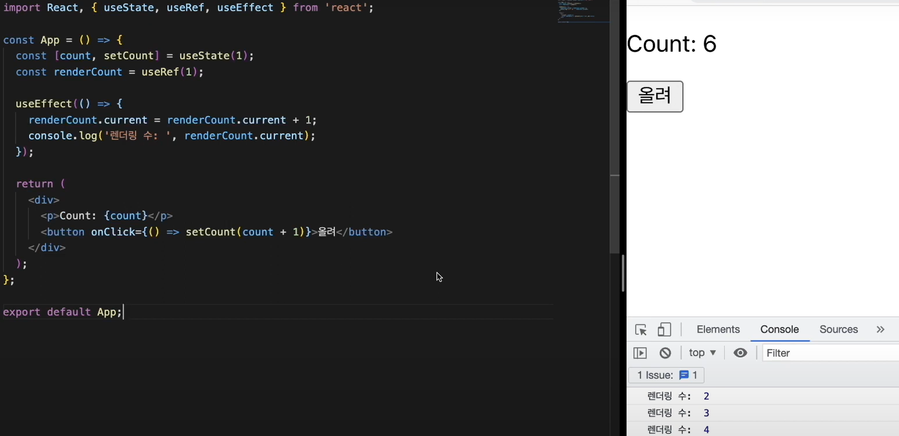
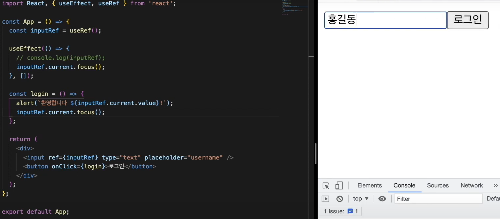

# useRef 로 특정 DOM 선택하기

### useRef의 사용
```useRef```는 크게 2가지의 방법으로 사용된다. <br/>

#### 저장공간
```useRef```는 State와 비슷하게 저장공간으로 사용되는데 <br/>

State의 변화 -> 렌더링 -> 컴포넌트 내부 변수들 초기화 <br/>
Ref의 변화 -> No 렌더링 -> 변수들의 값이 유지됨 <br/> 
State의 변화 -> 렌더링 -> 그래도 Ref의 값은 유지됨



useRef의 초기값을 1로 설정을 하고 useEffect를 이용하여 사이트가 새로고팀 되었을 때만 카운트되게 한다.

#### DOM 요소에 접근
js의 Document.querySelector()와 같이 React를 사용하는 프로젝트에서도 가끔씩 DOM 을 직접 선택해야 하는 상황이 필요하다. 그럴때 우리는 useRef라는 React Hook을 사용한다.



inputRef가 들어있는 ref의 태그를 가지고 와서 그 속성을 focus()로 효과를 줄 수 있다