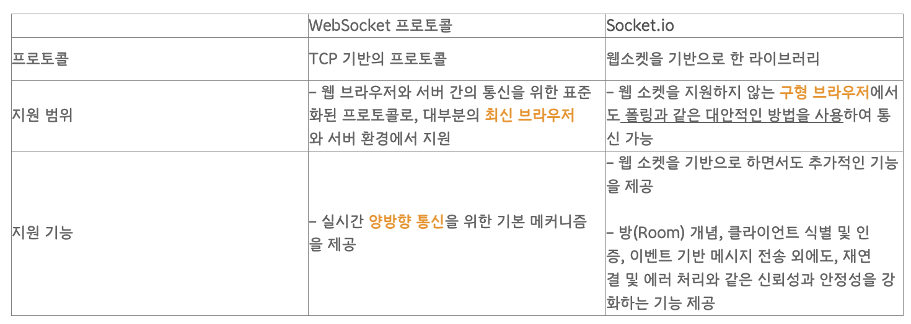

# #1 WebSoket

### 웹 소캣이란?

- 클라이언트와 서버를 연결하고 실시간으로 통신이 가능하도록 하는 통신 프로토콜이다.
- Websocket API를 통해 서버로 메세지를 보내고, 요청 없이 응답을 받아오는 것이 가능하다.

> 웹소켓은 연결을 유지하고 데이터를 주고받는 데 사용되며, 데이터의 일관성과 동기화를 담당하지 않는다.

### HTTP 통신과 SOCKET 통신 비교

#### HTTP

기존 HTTP는 단방향 통신이였다. 클라이언트에서 서버로 Request를 보내면 서버는 클라이언트로 Response를 보내는 방식으로 동작했다. 또한, HTTP는 기본적으로 무상태이므로 상태를 저장하지 않는다.

> 단방향 통신 : Client가 요청 보낼때만 Server가 응답한다.
>
> 무상태(Stateless) : Server가 Client의 상태값을 갖고 있지 않는다.
>
> 실시간 연결이 아니다.

#### Soket

웹소켓은 양방향 통신으로 연결이 이루어지면 클라이언트가 요청하지 않아도 데이터가 저절로 서버로부터 올 수 있다. HTTP처럼 별도의 요청을 보내지 않아도 데이터를 수신할 수 있다는 것이다.

> 양방향 통신 : Server와 Clinet가 계속 연결을 유지한다.
>
> 실시간 연결 : Server와 Clinet가 실시간으로 데이터를 주고 받는 상황이 필요한 경우에 사용된다.
>
> 실시간 동영상 Streaming이나 온라인 게임 등과 같은 경우에 자주 사용된다.

### 웹 소켓일 사용하는 경우

> 실시간 양방향 데이터 통신이 필요한 경우.
>
> 많은 수의 동시 접속자를 수용해야 하는 경우.
>
> 브라우저에서 TCP 기반의 통신으로 확장해야 하는 경우.
>
> 개발자에게 사용하기 쉬운 API가 필요할 경우.

### WebSocket과 socket.io

#### WebSocket과

- HTML5 웹 표준 기술
- 매우 빠르게 작동하며 통신할 때 아주 적은 데이터를 이용함
- 이벤트를 단순히 듣고, 보내는 것만 가능함

#### socket.io

- 표준 기술이 아니며, 라이브러리
- 소켓 연결 실패 시 fallback을 통해 다른 방식으로 알아서 해당 클라이언트와 연결을 시도함
- 방 개념을 이용해 일부 클라이언트에게만 데이터를 전송하는 브로드캐스팅이 가능함
