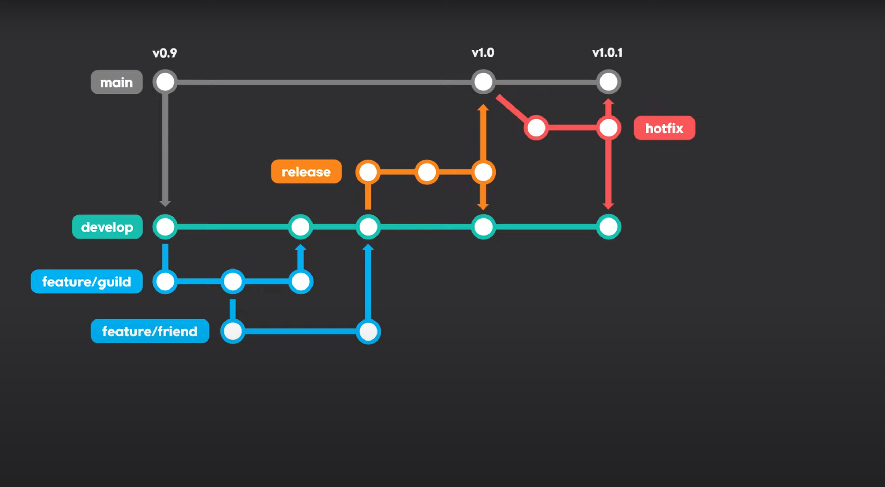
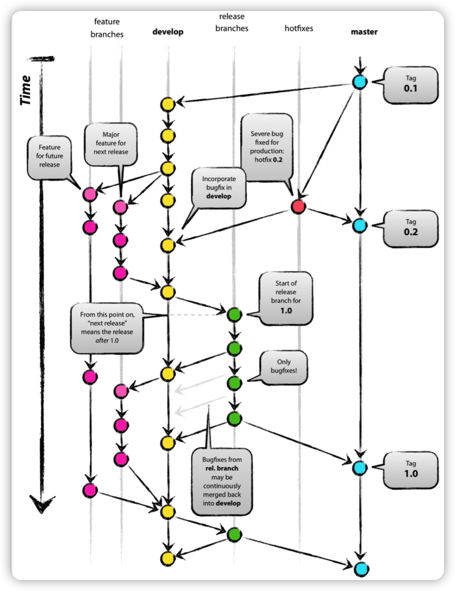

# git flow

> git Flow란?

 **git branch 관리 방법**이다.
 협업하는 사람들끼리 브랜치 관리에 대해 "우리 이렇게 브랜치 전략 짜자" 와 같은 전략이다.

 > git flow 브랜치와 그 의미

 - master : 소프트웨어 제품을 배포하는 용도로 쓰는 브랜치
 - develop : 개발용 default 브랜치로, 이 브랜치를 기준으로 feature 브랜치를 따고, 각 feature를 합치는 브랜치
 - feature: 단위 기능 개발용 브랜치
 - release: 다음배포를 위해 기능에 문제가 없는지 품질체크(QA) 용도의 브랜치
 - hotfix: 배포가 되고 나서(master에 배포 코드가 합쳐진 후) 버그 발생 시 긴급 수정하는 브랜치
 - support: 버전 호환성을 위한 브랜치

 > git flow 흐름 간략한 설명

 

 1. master 에서 시작

2. master가 base인 develop 브랜치 생성

3. 개발자1 : develop이 base인 feature 브랜치를 생성하여 개발 진행

    3-1. 개발자2 : develop이 base인 feature 브랜치를 생성하여 개발 진행

    ...

4. 개발 완료된 feature 브랜치는 develop으로 merge

5.  release 나갈 브랜치를 develop base 에서 생성

6. release branch에 있는 코드에 대해 QA를 진행하면서 버그를 고쳐나감.

7. QA 통과한 release branch는 이제 배포 준비 완료된 상태

8. 배포를 위해 release branch -> develop, master로 합침

9. master 브랜치에서도 각 코드 버전에 대한 기록을 남기기 위해 태그도 추가로 생성

10. 보통은 이렇게 생성된 태그로 배포

11. 만약 배포 나간 건에 대해서 긴급히 버그 처리해야할 경우 master base 기반으로 hotfix 브랜치 생성

12. hotfix 브랜치를 master, develop에 머지