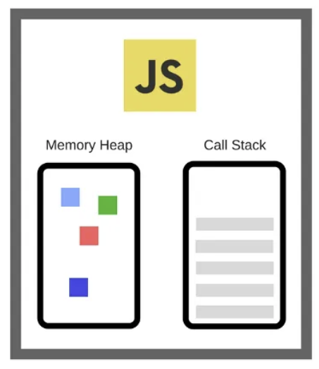

# Event Loop

### JS는 싱글쓰레드 언어인가?

#### 쓰레드란?

> 스레드는 프로세스 내에서 실행되는 가장 작은 실행 단위이다.
> 각 스레드는 자체적인 Stack을 가지고 있다.
> 프로세스는 단순히 현재 실행 중인 프로그램을 의미한다.

#### 싱글쓰레드 언어란?

말 그대로 하나의 쓰레드만을 사용하여 작업하는 것을 말한다. 이 말은 한번에 하나의 동작만을 처리할 수 있다는 뜻이다.
멀티쓰레드 보다 작업 효율이 떨어지지만 안전성과 복잡성, 리소스 효율성이 좋다.

#### 멀티쓰레드 언어란?

멀티쓰레드는 모든 작업을 병렬로 처리하는 것을 말한다. 멀티쓰레드는 사용하면 각 작업을 동시에 진행 할 수 있다.

#### 그렇다면 JS는?

js는 싱글쓰레드 언어이다.

그렇지만 아래와 같은 코드를 실행하면 조금 다르다는 것을 알 수 있다.

```tsx
console.log('hello!');

setTiemout(() => {
  console.log('3 seconds!');
}, 3000);

console.log('world!');
```

위에서 이야기 했든 js는 싱글쓰레드 언어 이기 때문에 이론상 hello! -> 3 seconds! -> world! 순으로 실행 되어야 한다.
하지만 직접 실행 해보면 hello! -> world! -> 3 seconds! 순으로 실행된다.

그렇다면 위와 같은 일이 왜 일어날까?

### JS가 비동기 작업을 처리하는 방법


#### Call Stack



Call Stack이란 함수를 실행했을 때 이 함수의 실행 즉, 프레임이 쌓이는 공간이다.
Stack 자료구조이기 때문에 LIFO(Last In First Out)을 준수한다.
먼저 실행한 것이 먼저 쌓이고 나중에 실행한 것이 먼저 빠지는 구조이다.
물론 Call Stack도 용량이 존제한다.

그렇다면 위의 코드를 다시 한번 떠올려 보면 console.log가 stack으로 쌓이고 그 다음으로 setTimeout이 쌓일것이다.

#### Web APIs


setTimeout은 V8엔진에서는 존재하지 않고 Web APIs에서 제공해주는 API이다.
우리의 JS 코드는 브라우저에서 돌아간다.
즉 call stack에 쌓이더라도 setTimeout은 Web APIs이기 떄문에 webAPIs에서 타이머가 병렬적으로 돌아간다.

#### Task Queue

위에서 실행했던 setTimeout의 타이머가 끝나면 Task Queue 공간에 들어가게 된다. 그 후 stack에서의 setTimout이 사라지게 된다.
이따 Task Queue는 Call Stack과 달리 큐 형태로 FIFO구조이다.

여기서 Evnet Loop가 동작한다. Evnet Loop의 역할은 Call Stack과 Task Queue를 주시하고
만약 Call Stack이 비어있으면 첫 번째 callback을 stack에 쌓아서 실행할 수 있도록 해준다.

#### Task Queue의 종류

> 여기서 Task Queue는 MacroTask Queue, MicroTask Queue 2개의 공간이 있다.
>
> 1.  MacroTask Queue
>
> - setTimeout, setInterval, I/O, 이벤트 핸들러 등의 작업이 처리되는 공간
>
> 2.  MicroTask Queue
>
> - Promise, async/await, then, catch, finally 등의 작업이 처리되는 공간
>
> MicroTask Queue가 우선순위가 더 높아 Call Stack이 비어있을 때 MicroTask Queue가 먼저 callback이 처리된다.
>
> 따라서 아래 코드를 실행하면?

```tsx
console.log('start');

setTimeout(() => {
  console.log('timeout');
}, 0);

Promise.resolve().then(() => {
  console.log('promise');
});

console.log('end');
```

> start ➡️ end➡️ promise➡️ timeout 순으로 출력된다.
