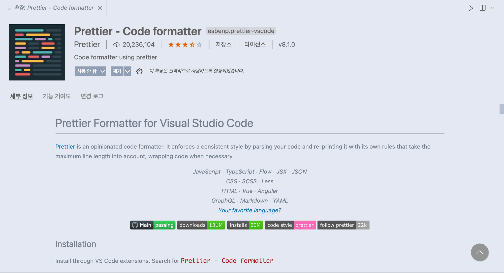

# Prettier

Prettier는 일관적인 코드 스타일을 유지할 수 있게 도와주는 툴이다.
즉 Prettier는 줄 바꿈, 공백, 들여 쓰기 등과 같은 스타일을 교정해준다.

### Prettier 설치

```
yarn add -D prettier
```

#### extension 설치



### .prettierrc 설정

```
{
 "printWidth": 120,
 "tabWidth": 2,
 "semi": true,
 "singleQuote": true,
 "trailingComma": "all",
 "endOfLine": "auto"
}
```

만약 prettier를 프로젝트에서 진행 한다면 prettierrc 파일을 만들어 prettierrc에 설정을 하는 것이 좋다.

### prettier과 eslint를 함께 사용한다면

ESLint의 plugin들의 rule 중 스타일과 관련된 것들도 있기 때문에 종종 Prettier와 충돌하는 일이 생긴다.

- eslint-config-prettier: Prettier가 인식하는 코드 포맷 오류를 ESLint 오류로 출력하도록 할 수 있다.
- eslint-plugin-prettier: ESLint의 코드 포맷과 관련된 rule 중 prettier와 충돌하는 부분을 비활성화할 수 있다.

```
yarn add -D eslint-config-prettier eslint-plugin-prettier
```
