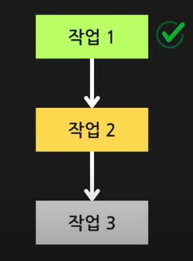
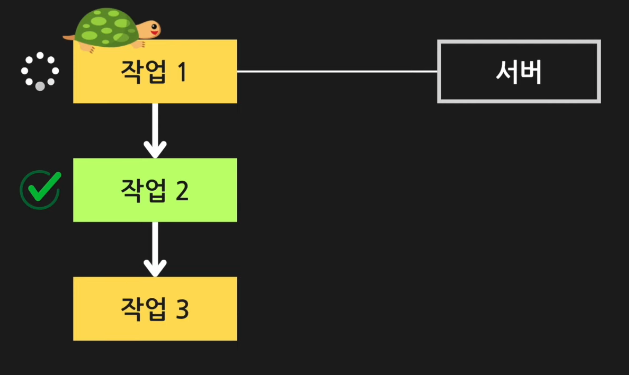
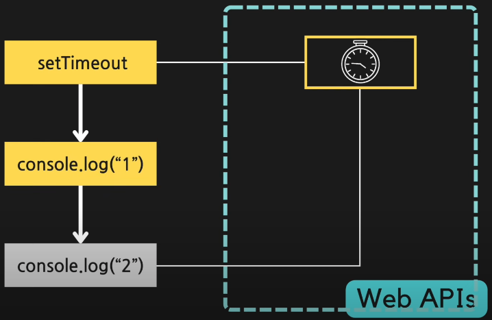

# #1 asynchronous

### 동기적 수행이란?

한번에 하나씩 순서대로 실행되는 것을 말한다.

즉 아래의 이미지와 같이 `작업1`이 실행되다 `작업1`이 종료 되길 기다렸다가 종료가 된다면 `작업2`가 실행되는 것을 말한다.

### 동기 프로그램의 문제

오래 걸리는 작업을 동기 프로그램으로 실행한다면 오래 걸리는 해당 작업이 끝날 때 까지 그 이후의 동작은 실행되지 않는 `Blocking`문제가 발생하기 때문이다.

### 비동기적 수행이란?

비동기적 수행은 동기적 수행과 달리 해당 작업이 끝날 때 까지 기다리는 것이 아닌 바로 다음 작업이 실행되는 것을 말한다.

즉 아래의 그림과 같이 `작업1`이 실행된 후 바로 `작업2`가 실행되어 `작업1`이 종료 될 때 까지 기다리는 것이 아닌 두개가 동시에 시작하는 것을 말한다.

### js는 싱글쓰레드 언어인걸?

js는 우리가 생각한 것 처럼 싱글쓰레드 언어이다.
그렇지만 비동기 처리가 가능한 이유는 브라우저에서 제공하는 멀티 쓰레드 기능을 가진 `Web APIs` 덕분이다.

이 이미지처럼 setTimeout을 코드의 가장 위에 올리고 console.log를 그 아래 두었다면 setTimeout은 `Web APIs`이기 때문에 setTimeout이 진행되는 동안 console.log가 찍히는 것 이다.
