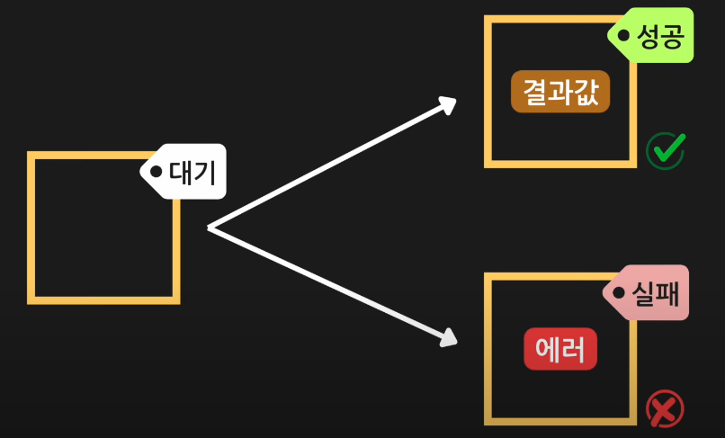
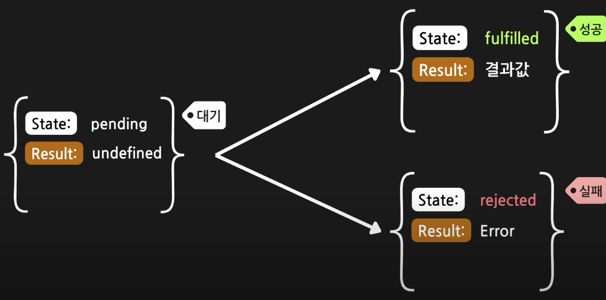

# #3 Promise

### Promise란?

비동기 처리에 사용되는 자바스크립트 객체 비동기 작업이 맞이할 `성공` 혹은 `실패`를 나타낸다.

즉 아래의 사진과 같이 비동기 작업이 시작 시 Promise가 실행되어 대기라는 표시가 붙은 작은 박스를 하나 생성한다. 그 후 해당 통신이 성공이라면 성공이라는 표시가 붙은 Promise 박스에 비동기 작업의 결과값이 들어간다. 만약 해당 통신이 실패라면 실패라는 표시가 붙은 Promise 박스에 에러가 들어가게 된다.



### Promise 박스의 형태



Promise 박스는 위의 사진과 같이 promise박스의 상태를 나타내는 `state`(Pending, Fulfilled, Rejected) promise의 결과를 나타내는 `result`로 구성되어있다.

### Promise 코드

```tsx
function getData() {
  const promise = new Promise((resolve, reject) => {
    setTimeout(() => {
      const data = { name: '철수' };
      if (data) {
        console.log('네트워크 요청 성공');
        resolve(data);
      } else {
        reject(new Error('네트워크 문제!!!'));
      }
    }, 1000);
  });

  return promise;
}

const promise = getData();

setTimeout(() => {
  console.log(promisse);
}, 2000);
```

이때 `new Promise((resolve, reject)`에서 resolve는 통신이 성공 했을 때를 나타내며 reject는 통신이 실패 했을 때를 나타낸다.

### Promise에서 제공하는 함수

Promise는 크게 `then()`, `catch()`, `finally()` 이러한 함수들을 제공하고 있다.

#### .then()

.then()는 resolve와 같이 동작이 성공 했을 때 실행되는 코드이다.

```tsx
getData().then((data) => {
  console.log('data');
});
```

#### .catch()

.catch()는 reject와 같이 동작이 실패 했을 때 실행되는 코드이다.

```tsx
getData()
  .then((data) => {
    //...
  })
  .catch((error) => {
    console.log(error);
  });
```

#### .finally()

.finally() Promise가 성공하던 실패하던 무조건 동작하는 코드이다.

```tsx
getData()
  .then((data) => {
    //...
  })
  .catch((error) => {
    //...
  })
  .finally(() => {
    console.log('마무리 작업');
  });
```

### Promise Chaining

```tsx
getData().then().then().then();
```

이러한 형태를 Promise Chaining이라고 한다.

```tsx
getData()
  .then((data) => {
    console.log(data);
    return getData();
  })
  .then((data) => {
    console.log(data);
    return getData();
  })
  .then((data) => {
    console.log(data);
    return getData();
  });
```

`철수가 3번 출력된다.`

이 때 만약 `return getData();`이렇게 promise를 return 해주면 어떻게 될까?

```tsx
getData()
  .then((data) => {
    console.log(data);
    return 'hello';
  })
  .then((data) => {
    console.log(data);
    return getData();
  });
```

이렇게 하면 처음은 철수가 출력되고 다음은 hello가 출력이 된다. 왜냐하면 `return 'hello';`이런식으로 할시 hello가 바로 promise로 감싸지기 때문이다.
