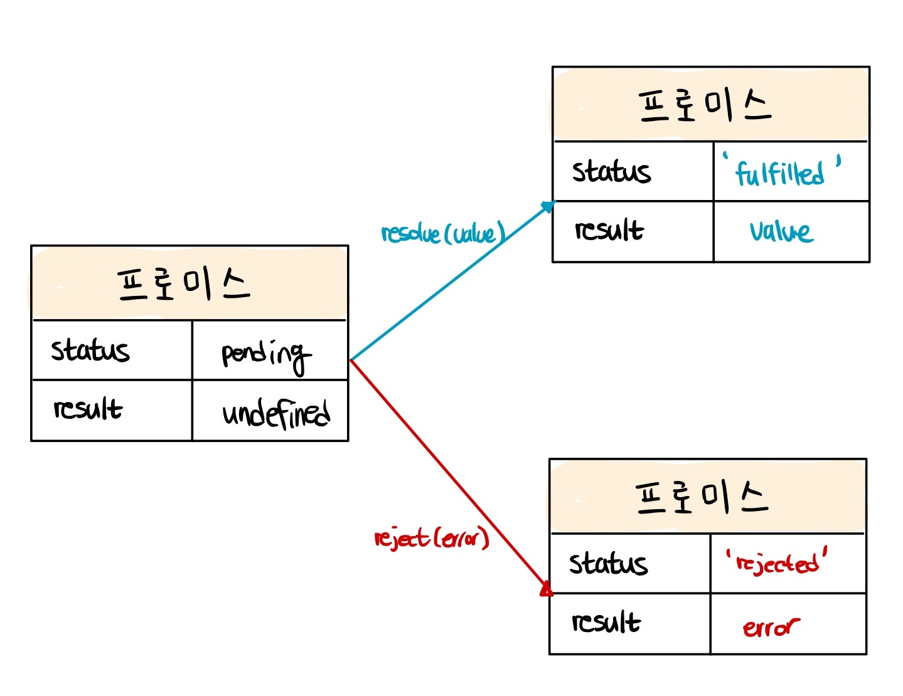

# #3 Promise

### Promise란?

자바스크립트는 비동기 처리를 위한 하나의 패턴으로 콜백함수를 사용한다. 하지만 이러한 콜백 함수를 매우 많이 사용하면 콜백 지옥으로 인해 가독성이 떨어지고 에러 처리가 힘들다는 문제가 있다. 이러한 문제를 해결하고자 ES6에서는 비동기 처리를 위한 또 다른 패턴으로 프로미스를 도입했다.

### 비동기 콜백의 단점

```tsx
// GET 요청을 위한 비동기 함수
const get = (url) => {
  const xhr = new XMLHttpRequest();
  xhr.open("GET", url);
  xhr.send();

  xhr.onload = () => {
    if (xhr.status === 200) {
      // 서버의 응답을 콘솔에 출력한다.
      console.log(JSON.parse(xhr.response));
    } else {
      console.error(`${xhr.status} ${xhr.statusText}`);
    }
  };
};

// id가 1인 post를 취득
const response_data = get("https://jsonplaceholder.typicode.com/posts/1");

console.log("response_data:", response_data);

>>>
response_data: ?
```

get 함수 내부에서 해당 데이터를 파싱하여 콘솔창에 찍을 때는 문제가 없었지만, get 함수 외부로 나와 해당 데이터 결과를 참조하여 사용하려 하니, undefined 가 출력된다.

get 함수는 비동기 함수이다. 자바스크립트 엔진은 실행 컨텍스트 스택(콜 스택) 에 아무런 실행 중인 컨텍스트가 없을 때, 즉 동기적인 코드가 모두 실행된 이후에 비로소 이벤트루프에 의해 태스크 큐에서 콜 스택으로 이동하여 비동기 함수를 처리한다.

즉 동기적인 코드가 모두 실행된 이후에 비동기적인 코드가 실행된다.

위의 문제를 해결하는 방법은 callback 함수를 사용하는 것 이다.

```tsx
const get = (url, callback) => {
  const xhr = new XMLHttpRequest();
  xhr.open('GET', url);
  xhr.send();

  xhr.onload = () => {
    if (xhr.status === 200) {
      callback(JSON.parse(xhr.response));
    } else {
      console.error(`${xhr.status} ${xhr.statusText}`);
    }
  };
};

const url = 'https://jsonplaceholder.typicode.com';

// id가 1인 post의 userId를 취득
get(`${url}/posts/1`, ({ userId }) => {
  console.log(userId); // 1

  // post의 userId를 사용하여 user 정보를 취득
  get(`${url}/users/${userId}`, (userInfo) => {
    console.log(userInfo); // {id: 1, name: "Leanne Graham", username: "Bret",...}
  });
});
```

하지만 콜백 함수를 사용하면 get 요청으로 응답된 데이터를 바탕으로 다시 한번 내부에서 콜백으로 요청을 하기 때문에, 코드의 양이 길어질수록 가독성이 떨어질 뿐만 아니라 유지 보수가 어렵게된다.

### 프로미스 생성

Promise 생성자 함수를 new 연산자와 함께 호출하면 프로미스를 생성한다.

Promise 생성자 함수를 비동기 처리를 수핼할 콜백 함수를 인수로 전달받는데 이 콜백 함수는 resolve와 reject 함수를 인수로 전달받는다.

```tsx
const promise = new Promise((resolve, reject) => {
  if (/* 비동기 처리 성공 */) {
    resolve('result');
  } else { /* 비동기 처리 실패 */
    reject('failure reason');
  }
});
```

Promise 생성자 함수가 인수로 전달받은 콜백 함수 내부에서 비동기 처리를 수행한다.

이때 비동기 처리가 성공하면 resolve를, 실패하면 reject를 호출한다.



fulfilled 또는 rejected 상태를 settled 상태라고 한다. settled 상태는 fulfilled 또는 rejected 상태와 상관없이 pending이 아닌 상태로 비동기 처리가 수행된 상태를 말한다.

프로미스는 pending 상태에서 fulfilled 또는 rejected 상태, 즉 settled 상태로 변화할 수 있다. 하지만 일단 settled 상태가 되면 더는 다른 상태로 변화할 수 없다.

### 프로미스의 후속 처리 메서드

프로미스의 비동기 처리 상태가 변화하면 이에 따른 후속 처리를 해야 한다.
이를 위해 프로미스는 후속 메서드 ① then, ② catch, ③ finally를 제공한다.

#### Promise.prototype.then

then 메서드는 두 개의 콜백 함수(resolve, reject)를 인수로 전달받는다. 하지만 reject를 사용하지 않고 보통은 resolve 값만 사용한다.

#### Promise.prototype.catch

catch 메서드는 한 개의 콜백 함수(rejected)를 인수로 전달 받는다. rejcted 상태인 경우만 호출된다.

#### Promise.prototype.finally

finally 메서드는 한 개의 콜백 함수를 인수로 전달받는다. finally 메서드의 콜백 함수는 프로미스의 성공 여부와 관계없이 무조건 한 번 호출된다.
