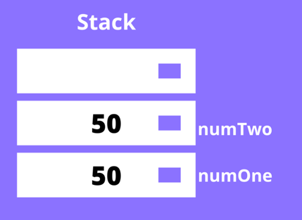
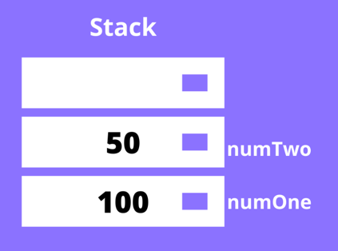

# data type

### 원시타입이란?

자바스크립트는 우선 아래와 같은 원시타입의 종류가 있다.

1. 숫자(number): 정수, 부동소수점 숫자, NaN(Not a Number), Infinity 등을 나타낸다.

2. 큰숫자(bigint): Number 타입으로 표현할 수 있는 범위를 초과하는 큰 숫자를 다룰 수 다를 수 있다.

3. 문자열(string): 문자열을 나타낸다.

4. 불리언(boolean): true 또는 false 값을 나타낸다.

5. null: 값이 없음을 나타낸다.

6. undefined: 값이 할당되지 않음을 나타낸다.

7. 심볼(symbol): ES6에서 추가된 데이터 타입으로, 객체 속성의 키로 사용된다.

> 이때 자바스크립트의 "string 타입" 은 메서드를 가지는데? 그러면 원시타입이 될수 없지 않은가?라는 의문이 생길 수 있다.

이는 자바스크립트의 런타임 과정에서 볼 수 있는데

```tsx
"tmp".concat();
```

자바스크립트는 위와 같은 코드를 런타임 과정에서 아래와 같이 변환한다.

```tsx
const str = new String("tmp");
```

### 원시타입이 동작하는 방법

자바스크립트에서 원시타입을 선언(declare) 하면, 이는 스택(stack) 에 저장된다. 스택이란 LIFO(Last In First Out) 구조를 가진 자료구조(data structure) 이다. 저장된 원시타입은 식별자를 통해 접근할 수 있고, 원시 데이터와 함께 스택에 저장된다.

```tsx
const numOne = 50;
const numTwo = 50;
```

위와 같이 같은 값을 가진 두개의 변수가 선언 및 할당되었을 때, numOne 이 값과 함께 스택에 푸쉬되고, 그 위에 numTwo 가 값과 함께 스택에 푸쉬된다. 같은 값이 있건 말건 전혀 상관없는 두개의 공간이 생성된다.



이때 numOne 의 값을 변경한다해도 numTwo 에는 전혀 지장이 없다.

```tsx
let numOne = 50;
let numTwo = numOne;
numOne = 100;
console.log(numOne); // 100
console.log(numTwo); // 50
```



### 참조타입이란?

자바스크립트의 참조타입 데이터는 원시타입과 다르게 동적이다(dynamic). 다르게 생각하자면 고정된 크기를 가지지 않는다.

대부분은 `객체(object)` 로 치환되며, 그렇기에 `메서드(method)`를 가진다. 예시로는 `array`, `function`, `object`, `date`, 등 많은 참조 타입 데이터가 있다.

### 원시타입과 참조타입의 차이

차이점은 참조타입 데이터를 저장해야할 때 생긴다. 변수를 선언 후 참조타입의 데이터를 할당하려 할때, 값은 해당 변수에 직접적으로 할당되지 않는다. 해당 변수에 저장되는 값은 메모리에 저장되어 있는 참조타입 값의 주소이다.


힙에 실제값이 저장되고 스택은 해당 힙을 가리키는 포인터를 가지게 된다.

스택은 포인터로 힙의 실제 값을 가리키고 있는 것이다.

```tsx
const object1 = {
  name: "hwani",
  age: 25,
};
const object2 = object1;

// object1 업데이트,
object1.age = 40;

console.log(object2.age); // 40
```

object1 이란 변수를 선언하였고, 객체를 할당하였다. 이후에 아까 원시타입과 같이 object2 를 선언 후 object1 를 이에 할당하였다. 그렇다면 힙에 새로운 객체가 생성될까? 답은 `생기지 않는다.`

해당 객체가 이미 힙에 존재하는한, object1 과 object2 는 같은 객체를 가리킨다.


즉 object2는 object1을 복사하였다. object2는 object1이 가지고 있는 포인터도 같이 복사하게 된다. 그로인해 object2는 object1이 가리키고 있던 값을 가리키게 된 것이다. 이로인해 object1를 사용하여 실제 값이 바뀌었을때 object2도 같은 포인터를 가지고 있기 때문에 값이 변하는 것이다.
