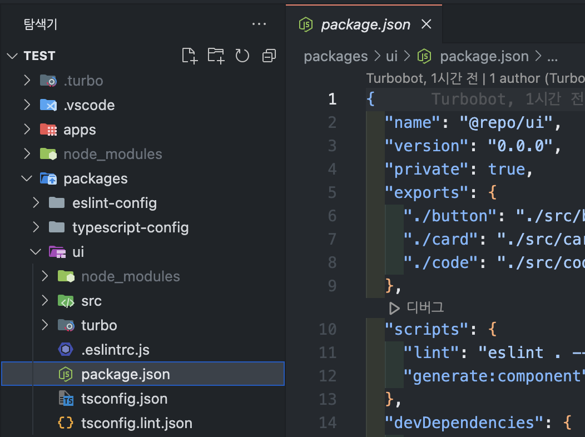

# turborepo

### turborepo란?

turborepo는 monorepo를 위한 라이브러리 툴이다.

- 프로젝트 초시 설정이 쉽다.
- 병렬처리 및 케싱으로 빌드 속도가 빠르다
- vercel에서 관리되고 있다.

### 프로젝트 설치

```tsx
yarn dlx create-turbo@latest
npx create-turbo@latest
pnpm dlx create-turbo@latest
```



위 방법 대로 설치를 하게되면 packages라는 폴더를 볼 수 있다.
packages/ui/package.json라는 파일을 보면 package name이 “@repo/ui”라는 것을 확인 할 수 있다.

그리고 apps/web{docs}/package.json 파일을 보면 package name이 “web”이라는것을 확인 할 수 있고 dependencies에 “@repo/ui”가 있는것을 확인 할 수 있다. 즉 web, docs는 로컬 “@repo/ui” 패키지에 의존하고 있다는것을 알 수 있다.

### imports와 exports이해하기

does와 webdml index.tsx를 보면 nextjs로 제작 되었으며 “@repo/ui” 라이브러리를 사용하는 것을 볼 수 있으며 둘다 `@repo/ui/button"`의 button을 불러오고 있다.

```tsx
import { Button } from "@repo/ui/button";

//...
<Button appName="docs" className={styles.secondary}>
  Open alert
</Button>;
```

다음으로 `packages/ui/package.json`을 보면

```tsx
{
  "exports": {
    "./button": "./src/button.tsx",
    "./card": "./src/card.tsx",
    "./code": "./src/code.tsx"
  },
}
```

위 코드를 접근하여 import 하고 있다.

즉 예시로 button에서의 변경이 일어난다면 위에서 본 web과 docs에서도 변경되게 된다.

### tsconfig

packages 폴더 아래 typescript-config와 eslint-config가 존재하는 것을 볼 수 있다.

typescript-config에 package.json의 name을 확인해보면 아래와 같다.

```tsx
"name": "@repo/typescript-config"
```

그후 docs와 web에 tsconfig.json를 보면

```tsx
"extends": "@repo/typescript-config/nextjs.json"
```

즉 “@repo”에 있는 typescript-config/nextjs.json을 tsconfig.json으로 가져오는것을 확인할 수 있다.
이로인해 모노레포가 코드를 공유하고 중복된 코드를 줄이고 있다는 것을 확인 할 수 있다.

### eslint-config

packages/eslint-config/package.json을 보면 아래와 같은 코드를 볼 수 있다.

```tsx
"name": "@repo/eslint-config",
"version": "0.0.0",
"private": true,
"files": [
  "library.js",
  "next.js",
  "react-internal.js"
],
```

이 파일도 보면은 name이 “@repo/eslint-config”이면서, files배열안에 있는 3가지의 파일이 있다는 것을 알 수 있다.

그후 docs나 web에있는 eslintrc.js파일을 열어보면

```tsx
module.exports = {
  extends: ["@repo/eslint-config/next.js"],
};
```

@repo/eslint-config/next.js를 .eslintrc.js 파일로 직접 가져오는 것을 볼 수 있다.
즉 위의 tsconfig와 마찬가지로 eslint를 공유하고 일관성을 유지하고 있는 것을 볼 수 있다.

> Turborepo CLI는 이러한 종속성을 관리할 책임이 없고, 위의 모든 작업은 선택한 패키지 관리자(npm, pnpm 또는 yarn)가 처리한다.

### Turborepo를 사용해서 lint구성 하기

```tsx
turbo lint
```

위 명령어를 실행하게 되면
각 워크스페이스에서 실행되는 스크립트는 각 워크스페이스의 package.json에서 가져온다.
각 워크스페이스는 선택적으로 자체 린트 스크립트를 지정할 수도 있다.

### cache 사용

`turbo lint`를 실행하면 총 3개의 파일이 cached된다. 여기서 눈 여겨 볼점은 lint script가 실행된 이후 코드가 변경되지 않았다는것을 알 수 있다.
기존에 Page에 있던 Button 컴포넌트를 사용한 곳에서 타이틀을 변경후 다시 script를 실행 해보면 터미널에서 2개의 캐시된 파일이 있는것을 확인 할 수 있다.

### Turborepo로 빌드하기

```tsx
turbo build
```

위 명령어로 실행하면 apps/docs와 apps/web package.json에 build 스크립트만 실행되는것을 볼 수 있고 캐시가 되는것을 알 수 있다.

web과 docs는 모두 NextJs앱 이며 폴더를 살펴보면 .next가 생성되는것을 알 수 있다.

.next폴더를 삭제하고 다시 turbo build를 실행해보면 알 수 있다.
(터보레포가 이전빌드한 파일을 캐시하고 .next/\*\* 폴더가 복원되는것을 알 수 있다.)

### dev 환경 실행하기

```tsx
turbo dev
```

위에 스크립트를 실행하면 docs와 web만 실행되는것을 알 수 있다.

port:3000번과 port:3001번에서 실행되는것이 확인 된다.

### 하나의 workspace만 실행하기

```tsx
turbo dev --filter docs
```
